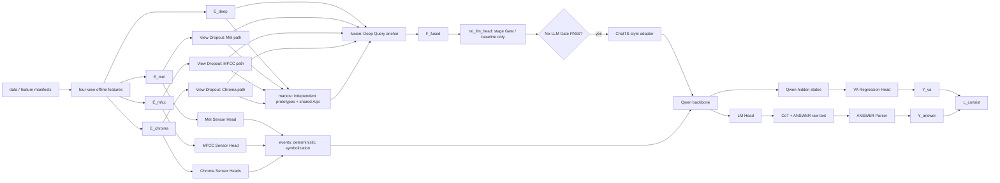

# SC-MV-DMER Foundation Design

> 状态：Foundation 三批设计已获用户批准并冻结；研究语义闭包完成。当前审计结论为 `CONDITIONAL_PASS_EXECUTION_BLOCKED`，`FORMAL_EXECUTION_READY=NO`，M0 为 `READY_TO_CLOSE`（等待可机器核验的人类批准 provenance transcription）。本文档不授权实现、训练或 formal run。

## Authority and Traceability

- 原始研究设计基准：`research_plan.docx`
- 人类可读研究语义 Source of Truth：`docs/research/RESEARCH_SPEC.md`
- 受控决定日志：`docs/research/DECISIONS.md`
- 本文档角色：把已批准研究语义转化为可实现、可测试、可追踪和可复现的工程设计

任何未由原始研究方案直接规定的内容均作为 `Engineering Decision` 记录。冻结研究语义的变更必须遵循：`DECISIONS.md` → `RESEARCH_SPEC.md` → config/schema 更新 → version bump。

## 1. Configuration Architecture

### 1.1 Layered input and strict resolution

配置采用分层 YAML 输入：research defaults → dataset/feature config → model config → versioned experiment overlay → runtime profile → 显式 CLI override。合并结果必须经过版本化 schema、跨字段约束和研究不变量校验，随后保存完整 resolved config 及规范化 JSON 快照。

research defaults 是 `RESEARCH_SPEC.md` 的机器可执行映射，不是独立研究定义。A1-A13、baseline、main、multi-seed、cross-dataset 和 scaling 实验使用同一配置接口；研究变量通过版本化 overlay 表达，不得依赖手改源码。

### 1.2 Semantic identity versus execution identity

每个 run 至少计算两个 SHA-256：

- `semantic_config_hash` 标识论文意义上的具体实验实例。它包含 dataset version、split manifest/hash、feature definition、model architecture、Markov/sensor/event setting、loss definition、evaluation protocol、experiment overlay，以及该实例的 seed。
- `resolved_config_hash` 覆盖最终完整 resolved config，用于复现这一次具体执行。

semantic identity 排除 batch size、gradient accumulation、num_workers、device、本地路径、checkpointing、machine name、GPU type、output directory 和 timestamp。同一研究实验只更换 runtime profile 时，semantic hash 必须不变；resolved hash 可以变化。

### 1.3 Deterministic canonicalization

两个 hash 均从适用于各自身份范围的 canonical JSON 计算，不直接散列 YAML 文本。canonicalization 必须：

- 固定 key 排序并使用 UTF-8；
- 统一 bool、null、数值和 enum 表示；
- 排除相应身份范围之外的时间戳等随机字段；
- 防止 Windows/Linux 路径形式影响 semantic hash；
- 防止本地绝对 data root、output path 或 machine metadata 进入 semantic identity。

### 1.4 Formal and debug run modes

`formal` run 的 CLI override 只允许修改 runtime allowlist，例如 device、batch size、gradient accumulation、num_workers、precision 和 checkpointing。dataset split、feature semantics、model architecture、`markov.shared_A`、`sensor.enabled`、`events.enabled`、loss definition 和 evaluation protocol 等研究字段禁止通过 CLI 修改，必须由已版本化 overlay 表达。

`debug` run 可在显式授权范围内使用研究语义 CLI override，但必须记录 `run_mode=debug`，且不得自动进入正式 paper result aggregation。

### 1.5 Provenance chain and semantic diff

`run_spec` 除保存 resolved config 外，还必须保存：

- research defaults 文件及 hash；
- dataset、feature、model config 文件及 hash；
- experiment overlay 与 runtime profile 文件及 hash；
- CLI overrides；
- `config_schema_version` 与 `research_spec_version`；
- `semantic_config_hash` 与 `resolved_config_hash`；
- 相对正式主模型的机器可读 `semantic_diff.json`。

`semantic_diff.json` 必须直接说明实验改变了哪些研究变量。例如 A3 应表现为 `markov.shared_A: true → false`，而不是要求审计者人工比较两份完整配置。

### 1.6 Schema and research invariants

schema 不只校验 unknown key、类型和必填字段，还必须执行跨字段及研究语义验证。formal run 至少验证冻结 DEAM split hash、2Hz 主时间基准、runtime profile 不修改 research semantic fields、overlay 修改权限、已批准模块依赖，以及数据/feature cache version 已登记。A1-A13 的具体模块依赖关系只在后续设计节获得批准后加入，不得提前猜测。

### 1.7 Forward-only versioning

配置至少维护 `config_schema_version` 和 `research_spec_version`。旧 run 永久保留创建时的版本和原始 snapshot；新 schema 不得静默重新解释旧配置。任何迁移必须显式执行，并保留迁移前后记录，不回写历史 run。

## 2. Repository and Data Boundaries

### 2.1 Repository layout

Git 仓库保存 `configs/`、`schemas/`、`manifests/`、`src/sc_mv_dmer/`、`tests/`、`docs/`、`reports/` 与 `paper/`。模块目录至少覆盖 data、features、encoders、sensors、markov、fusion、llm、losses、metrics、training、evaluation 和 experiments。`reports/` 与 `paper/` 只引用 finalized formal run 的 `run_id` 与 checksum，不依赖临时路径。

外部 data root 保存 `raw/`、`interim/`、`processed/`、`features/`、`pseudo_labels/`、`upstream_models/`、`runs/<run_id>/` 与 `tmp/`。本机默认值为 `D:\SC-MV-DMER-data`；它是 runtime 配置，不进入 semantic identity。实现不得依赖固定盘符、junction 或符号链接。

### 2.2 Data-zone rules

`raw` 是不可原地修改的证据层。清洗、重采样、切片和身份规范化必须产生新的 interim/processed version。primary split manifest 体积小且决定研究语义，因此保存在 Git；它只引用稳定 ID，不包含绝对路径。

run 的 `run_spec`、resolved config、semantic diff、日志、指标、checkpoint、artifact 和最终 manifest 均归属于同一外部 `runs/<run_id>/`。不得使用会覆盖历史证据的共享 `latest.ckpt`。

### 2.3 Upstream model manifest

每个外部预训练模型必须先登记 upstream model manifest，至少包含稳定 `upstream_model_id`、提供方/仓库、精确 revision、来源、许可、预期文件、文件 checksum 和本地验证结果。formal run 通过 manifest identity 引用 MERT、Qwen 等模型，不得引用未固定 revision、未登记本地文件或可漂移的 `latest`。

本地绝对缓存路径只用于 path resolution，不进入 semantic identity。更换机器时，同一模型 manifest 与内容 checksum 必须解析到等价模型内容。

### 2.4 Stable dataset identity contract

`dataset_id` 标识已登记的数据集版本；`song_id` 标识稳定歌曲级实体；`sample_id` 标识具体片段/样本，并确定性关联 dataset、song、源记录和片段边界。三者不得依赖盘符、绝对路径或可变文件名。

同一歌曲的所有片段共享 `song_id`，split 以 `song_id` 为分组边界。源数据缺少可靠 ID 时，在 ingestion 阶段生成并冻结 source-to-stable-ID mapping。已发布 ID 不复用；纠错通过可追踪的修订、alias 或 tombstone 记录处理，不静默重编号。

### 2.5 Versioned sensor, event, and CoT derivations

`sensor_labels`、`symbolic_events` 与 `cot_targets` 是三个独立派生层，各自具有 version、schema 与 manifest。每个版本记录父级 fingerprint、生成配置 hash、生成代码版本、schema version、记录数量和内容 checksum，形成 `dataset/features → sensor labels → symbolic events → CoT targets` lineage。

任一上游输入、sensor 定义、确定性事件规则或 CoT 生成/过滤规则改变时，必须生成新的对应版本及受影响下游版本；禁止原地覆盖或让旧下游数据静默绑定新上游语义。

### 2.6 Feature cache immutability

feature cache 与 split 解耦，并绑定稳定 sample identity、dataset fingerprint、upstream model manifest（适用时）、feature definition、提取配置、提取代码版本、schema、shape/dtype/time grid 和内容 checksum。

构建中的 cache 处于 staging 状态。只有完整性、shape/dtype、时间对齐和 checksum 校验全部通过后，才能原子化登记为 finalized version。finalized cache 内容与版本均不可变；任何输入、定义、代码或 schema 变化必须创建新版本。formal run 必须引用精确 version，不得使用 `latest` 或混合未声明版本。

## 3. Module Boundaries and Interface Flow

> 审批状态：Approved / Frozen（2026-08-12）。后续任何修改必须先在 `docs/research/DECISIONS.md` 中形成显式、可追踪的决定。

### 3.1 Ownership and orchestration

`experiments/` 只负责读取已批准 overlay、构建组件依赖、创建 `run_spec` 并调用 training/evaluation，不拥有模型公式。`training/` 管理优化过程；`evaluation/` 对模型、阈值和数据成员只读。`losses/` 与 `metrics/` 是显式消费 prediction/target contract 的纯计算边界。

`contracts/` 与 `provenance/` 统一拥有 stable identity、time-grid/mask、schema version、fingerprint、配置身份和序列化 artifact envelope。模块不得读取隐藏全局配置或硬编码路径。

### 3.2 Stage-gated module flow



### 3.3 Sensor gradient and input boundary

Sensor Heads 直接消费未经 View Dropout 修改的 `E_mel`、`E_mfcc`、`E_chroma`。`L_sensor` 在训练时必须沿对应 Sensor Head 反向传播至相应手工视图 Encoder；该边界不得 detach，也不得只训练 Sensor Head。

Sensor 不得从 `F_fused`、Markov state、`gamma/gamma_tilde` 或 Markov/Fusion 的其他输出派生。该限制保持 Sensor supervision 对特定手工声学视图的保活作用，并防止融合信息倒灌后掩盖单视图退化。

### 3.4 View Dropout topology (Engineering Decision)

每个手工视图 Encoder 的原始 `E_v` 先分叉：一支直接进入对应 Sensor Head；另一支在训练时经过 View Dropout，再进入 Markov/Fusion 路径。View Dropout 不得污染 Sensor branch 或 `L_sensor` supervision。Deep view 永不 dropout。

View Dropout 只改变主模型使用该手工视图的路径，不改变 stable identity、feature cache、Sensor target 或 EventSequence 的来源记录。推理时 Markov/Fusion 使用全部未 dropout 视图。

### 3.5 Markov and fusion boundary

四个视图保留独立原型，Markov 模块拥有共享状态转移矩阵 `A` 与共享初始分布 `pi`，输出状态分布、正则化状态轨迹及状态诊断。Fusion 以 Deep view 为 Query anchor，以经主路径处理后的 Mel/MFCC/Chroma 为 Key/Value，并消费 Markov consistency bias 与可学习 `beta_v`，输出 `F_fused`。

禁止在该边界退化为普通 early feature concatenation。A1-A13 的完整可选模块依赖矩阵在后续设计节单独批准。

### 3.6 EventSequence provenance contract

EventSequence 必须由确定性 symbolizer 生成，并至少保存：

- `event_source`，枚举为 `pseudo_label` 或 `sensor_prediction`；
- 对应 SensorBundle 的稳定 identity/hash；
- symbolizer rule version；
- 每个事件的 segment boundaries；
- 事件记录与源 sensor evidence 的可追踪引用。

训练阶段从 pseudo label 切换到 sensor prediction 时，必须由版本化配置明确表达，并形成新的派生数据/run provenance；禁止事件来源在代码路径中隐式变化。LLM 不拥有事件生成规则，也不得补造未由 EventSequence 提供的源事件。

### 3.7 No-LLM head lifecycle

`no_llm_head` 是无 LLM 阶段的 Gate/baseline head，用于验证四视图、Sensor、Markov 和 Fusion 主线是否达到或接近经典 baseline。它不是 Full LLM 模型的永久预测支路。

只有 No-LLM Gate PASS 后才允许集成 ChatTS-style adapter 与 Qwen。正式 Full LLM 模型默认只使用其 VA Regression Head 和 LM Head，不得默认 ensemble、平均或回退到 `no_llm_head` 输出。任何额外 ensemble 必须作为独立、明确批准的实验定义。

### 3.8 Explicit LLM dual-head contract

`F_fused` 经 ChatTS-style adapter 形成 time-series tokens，与明确来源的 EventSequence 一起进入 Qwen。双头路径必须显式分离：

1. Qwen hidden states → VA Regression Head → 原始 `Y_va`；
2. Qwen → LM Head → 原始 CoT/ANSWER 文本 → ANSWER Parser → `Y_answer`；
3. `Y_va` 与有效解析的 `Y_answer` → `L_consist`。

PredictionBundle 必须同时保存两路原始输出、ANSWER 原始文本、parser 状态/错误、解析后的 `Y_answer`、有效 mask，以及 `L_consist` 所使用的一致性证据。不得只保存最终合并数值或丢弃解析失败证据。

### 3.9 Required contracts and fail-fast rules

模块边界至少使用 `SampleRef`、`TimeGrid/Mask`、`ViewFeatureBundle`、`EncodedViewBundle`、`SensorBundle`、`MarkovBundle`、`EventSequence` 与 `PredictionBundle`。序列化 artifact 必须携带 schema version、stable IDs、lineage 和 checksum。

任何 view identity、shape、dtype、time grid、mask 或 provenance 不匹配都必须 fail fast，禁止静默 trim、pad、重排、替换或跨版本混用。

## 4. Run Lifecycle and Research Gate State Machine

> 审批状态：Approved / Frozen（2026-08-12）。后续任何修改必须先在 `docs/research/DECISIONS.md` 中形成显式、可追踪的决定。

### 4.1 Two independent state machines

Run lifecycle 描述一次具体执行，Research Gate lifecycle 判断某个研究阶段是否拥有足够证据继续前进。进程成功、run finalization 或指标文件存在都不自动等于 Gate PASS。一个 Gate 可以消费多个 formal run、测试、图表和人工审阅证据。

每个阶段遵循：Frozen Input / predecessor PASS → Implementation → Tests → Formal Experiment → Artifacts / Evidence Bundle → Gate Evaluation → stage-close Git commit。只有 predecessor Gate 的有效 PASS 和对应 predecessor stage-close commit 均存在时，下一阶段才能开始。

### 4.2 Run creation and irreversible terminal states

formal/debug run 均采用两阶段 manifest 生命周期：

1. PRE-FLIGHT 解析并验证配置、run mode、注册输入、研究不变量、Git 状态、存储和环境；
2. 在计算开始前原子写入 `run_spec`，冻结 `run_id`、配置 provenance、semantic/resolved hash、启动命令、输入和计划输出；
3. RUNNING 期间只向该 run 的受控目录追加日志、指标和 checkpoint；
4. finalizer 产生 `SUCCEEDED`、`FAILED` 或 `INTERRUPTED` 之一，并原子发布 final `run_manifest`。

`SUCCEEDED`、`FAILED`、`INTERRUPTED` 都是不可逆终态。final manifest 发布后，整个 run 在逻辑上封存；已有 metrics、checkpoints、artifacts 和 terminal record 不允许修改、补写、删除或重新打开。

### 4.3 Continuation, resume, and post-hoc evaluation

跨机器恢复、从 checkpoint 续训或对终态 run 的任何继续执行都必须创建新的 `run_id`。新 run 通过 `parent_run_id`、`continuation_of` 和 `resume_from_checkpoint` 显式建立关系，并重新完成 PRE-FLIGHT 和两阶段 manifest 流程。

若研究语义未改变，新 continuation 应保持适用的 `semantic_config_hash`；runtime 或恢复位置可以使 `resolved_config_hash` 改变。若续训同时改变研究语义，则必须产生新的 semantic identity，禁止借 continuation 关系掩盖语义变更。

任何 post-hoc evaluation 都创建独立的 evaluation run，并通过 `source_run_id` 引用被评估的已封存 run。不得向 source run 追加新 metrics、parser 结果、图表或 artifact。

### 4.4 Formal Git cleanliness

formal run 的 PRE-FLIGHT 必须验证研究相关 Git workspace clean，并记录精确 commit。存在 tracked 修改或研究相关 untracked 文件时，formal run 必须中止，或在明确降级为 `run_mode=debug` 后重新创建 run；不得自动 stash、自动 commit 或以 dirty formal run 继续。

debug run 可记录 dirty state 和 diff provenance，但仍不得进入正式 paper/report aggregation。

### 4.5 Heartbeat, lease, and stale-run recovery

RUNNING 状态使用版本化 heartbeat/lease policy。policy 必须记录 `lease_policy_version`、heartbeat 规则、stale 判定阈值和 recovery authority。不得使用未记录的固定超时静默判定 run 已失败。

stale RUNNING 的 recovery finalization 必须保存 last heartbeat、检测时间、原 host/process 信息、lease policy、recovery actor、判定理由和可用 partial artifact/checkpoint provenance，并将原 run 终结为 `INTERRUPTED`。后续恢复创建新的 continuation run，不重新打开原 run。

### 4.6 Append-only invalidation and supersession

若在 run finalization 后发现数据泄漏、实现错误、损坏 artifact、错误评估或其他证据失效，不得修改旧 run 或 Gate record。必须追加独立的 invalidation/supersession record，至少包含目标 identity、理由、证据、authority、时间和可选 replacement identity。

原始 terminal record 永久保留。paper/report aggregation 必须解析 append-only invalidation/supersession registry，并排除已 invalidated 的 run、artifact 或 Gate evidence；不得仅依据旧 PASS/SUCCEEDED 状态聚合。

### 4.7 Gate Definition versus Gate Evaluation Attempt

Gate Definition 与 Gate Evaluation Attempt 是不同实体：

- Gate Definition 保存 `gate_id`、`gate_version`、冻结 criteria、每项 criterion 的 automatic/manual authority、required evidence 和 predecessor dependency。
- Gate Evaluation Attempt 保存唯一 `gate_evaluation_id`、`gate_version`、递增 `attempt`、`evidence_bundle_hash`、criterion-by-criterion 结果、verdict、authority 和评审 provenance。

同一冻结 criteria 可以有多个不可变 evaluation attempts；新的证据或修复后重评只增加 attempt，不增加 Gate version。只有 criteria、threshold、required evidence 或 authority 规则改变时才增加 `gate_version`，并通过 `DECISIONS.md` 记录。旧 attempts 永远保留其原 gate version。

### 4.8 Automatic and manual authority

每项 criterion 必须显式声明为 automatic、manual 或需要二者。Automatic criterion 可由受控程序计算；manual criterion 必须保存真实人工审阅者的明确判定和证据。

Codex 可以计算 automatic result、整理 evidence、指出冲突并给出 `recommended_verdict`，但不得自行生成、代填或冒充 human approval。需要人工 criterion 的 Gate 只有在有效 human approval 到位后才能形成最终 PASS。

### 4.9 Evidence commit and stage-close commit

为避免自引用，Gate Evaluation Record 只保存其评估所依据的 `evidence_commit`，不得保存包含该 Gate Record 自身的 stage-close commit hash。

Gate PASS 后，将 Gate Definition reference、Gate Evaluation Record 和相关冻结文档提交为 stage-close commit。下一阶段的 entry record / run_spec 保存 `predecessor_stage_close_commit`，从而建立无循环的阶段链。

### 4.10 Paper eligibility and blocked handoff

正式 paper/report aggregation 要求同时满足：`run_mode=formal`、run `SUCCEEDED`、完整且未失效的 provenance/checksum、相关 Gate 有未 invalidated 的 PASS attempt，并且 evidence 未被 supersession policy 排除。

本机资源不足时，Gate/attempt 可标记 BLOCKED 并保留 OOM、显存实测、配置、manifest、checksum 和命令，通知用户转移到其他环境。BLOCKED 不得伪装为 PASS；外部环境执行必须创建新 run，并通过 continuation/provenance 关系保持适用的 semantic identity。

### 4.11 Prohibited transitions

禁止以下行为：终态 run 重新进入 RUNNING；在终态目录进行 post-hoc 写入；SUCCEEDED 自动触发 Gate PASS；debug run 进入 paper aggregation；修改已有 evaluation attempt；在观察结果后静默改 Gate criteria；Gate Record 引用包含自身的 commit；忽略 invalidation registry；无 predecessor PASS/stage-close commit 进入下一阶段。

### 4.12 Effective Validity and Dependency Propagation (Engineering Decision)

历史事实与当前有效性必须分离：

- `historical_verdict` 永久保存 Gate Evaluation Attempt 当时的原始 PASS/FAIL/BLOCKED，不得修改。
- `effective_verdict` 由当前 append-only invalidation/supersession registry、active Gate Definition 和 predecessor dependency graph 动态计算。

如果某个 Gate Evaluation Attempt、其 evidence bundle、source run、artifact 或 evidence commit 后来被 invalidated，该 attempt 的 historical PASS 仍是历史事实，但其 `effective_verdict` 不再构成有效 PASS。

当前有效性至少派生为：

- `VALID`：自身证据有效，所需 predecessor 也具有当前有效 PASS；
- `INVALIDATED`：该实体或其直接证据已被显式 invalidation record 判定失效；
- `STALE_DEPENDENCY`：实体本身的历史执行未被判定失败，但其研究结论依赖的上游 Gate/evidence 当前已失效或不再 active。

`STALE_DEPENDENCY` 不修改原始 run、Gate Attempt 或 stage-close commit，也不等价于 run 执行失败。它表示需要重新 Gate evaluation、重新执行受影响工作，或由真实人工 authority 明确确认影响范围。

下一阶段 entry、formal aggregation、paper/report generation 和 predecessor 检查必须查询 effective validity，不得只读取历史 PASS。有效性解析器必须沿显式 provenance/dependency graph 传播，并产生可审计的影响报告，至少列出：invalidated source、directly affected Gate attempt、downstream stages/runs、propagation reason，以及 replacement/superseding evidence（如有）。禁止无依据地删除全部后续阶段，也禁止忽略有明确依赖的下游影响。

当新 Gate version supersede 旧版本时，active Gate Definition 由同一 effective-validity resolver 根据 append-only supersession 记录确定。旧 Gate Definition、旧 attempts 和旧 PASS 永久保留为历史事实，但未来阶段不得把 inactive/superseded Gate version 的 PASS 误当成当前有效 predecessor。

## 5. Exact Research Gate Catalog

> 审批状态：Approved / Frozen（2026-08-12）。RG-01 至 RG-10 均已逐项获得用户批准并冻结；后续任何 criterion、threshold、authority、dependency 或 evidence requirement 变化必须先写入 `DECISIONS.md` 并提升相应 Gate version。

### 5.1 RG-03 Sensor Independent Validation — Approved / Frozen Criteria

RG-03 使用固定、无歌曲泄漏的 Sensor train/validation 划分进行独立预验证。test split 不参与 early stopping、checkpoint 选择、threshold 调整、normalization 拟合或 Gate verdict；test 只保留给后续正式评估。

#### Mode-strength criterion

调式强度回归在冻结 validation split 上必须达到 `CCC > 0.7`，与研究方案原始阈值保持一致。

#### Energy and brightness MSE-convergence criterion

能量头与亮度头分别满足以下全部条件才视为“MSE 收敛”：

1. model validation MSE 与 constant baseline validation MSE 都是有限值；
2. constant predictor 只使用 Sensor-train targets 拟合，禁止读取 validation/test target 统计量；
3. model 与 baseline 在同一冻结 validation membership、同一 target normalization 和同一 metric implementation 下比较；
4. 对每个 target，`MSE_model <= MSE_train_only_constant - tolerance`；
5. 数值容差定义为 `tolerance = max(1e-8, 1e-6 * abs(MSE_train_only_constant))`，用于排除浮点舍入造成的虚假“严格优于”，不构成额外效果量阈值；
6. 训练按预登记 early-stopping 规则结束，并保存完整 train/validation 曲线、停止原因和最佳 checkpoint identity/hash。

#### Target normalization provenance

若 target 需要 normalization，其参数只能在 Sensor-train split 上拟合，再原样应用于 validation/test。Gate evidence 必须记录：target name、源 pseudo-label version/hash、normalization transform、fit-split fingerprint、拟合参数、实现/schema version，以及 model/baseline metric 所使用的单位与空间。禁止使用 test 统计量重新归一化或选模。

#### Evidence and authority

RG-03 automatic evidence 至少包含冻结 split fingerprint、完整曲线、最佳 checkpoint、逐 target baseline/model MSE、tolerance、CCC 和 normalization provenance。Gate Evaluation Attempt 必须保存原始数值而非只有布尔结果。任何人工数据质量审阅作为独立 manual criterion 记录，Codex 不得代填 human approval。

#### Key-classification criterion

调性分类头不增加研究方案未提供的 accuracy/macro-F1 硬阈值，而使用 train-only class-prior baseline 验证其训练有效性：

1. class-prior probability 只从 Sensor-train 的有效 5 秒 segments 统计；
2. 对零频类别使用 Laplace/add-one smoothing，`p_c = (n_c + 1) / (N + C)`，其中 `C` 是冻结 class contract 的类别数；
3. model 与 prior baseline 的 validation CE 都必须为有限值，并满足 `CE_model <= CE_train_only_prior - tolerance`；
4. `tolerance = max(1e-8, 1e-6 * abs(CE_train_only_prior))`，只用于排除浮点等价；
5. model 与 baseline 必须使用同一版本化 class vocabulary/order、相同 target encoding、相同 5 秒 segment boundaries、相同 valid/missing-label mask 和相同 CE reduction；
6. checkpoint 选择与 early stopping 只依据预登记 validation CE，test、accuracy、macro-F1 或人工挑选不得参与选模；
7. test 不参与 prior 拟合、smoothing、选模或 Gate verdict。

Gate evidence 还必须保存 smoothing 参数、train class counts/prior、class/mask/segment contract identity、validation accuracy、macro-F1、混淆矩阵和类别支持度。后四项是诊断证据，不是硬 PASS threshold。

### 5.2 RG-04 No-LLM versus CRNN — Approved / Frozen Criteria

RG-04 的 `0.02` 逐维 CCC 接近界限是预注册 `Engineering Decision`，不是 `research_plan.docx` 或既有文献提供的阈值。必须在观察 RG-04 结果前冻结 CRNN reference、threshold 和比较协议。

定义：

- `Delta_V = CCC_noLLM,V - CCC_CRNN,V`；
- `Delta_A = CCC_noLLM,A - CCC_CRNN,A`。

RG-04 PASS 当且仅当：

`Delta_V >= -0.02 AND Delta_A >= -0.02`。

PASS 后的描述标签为：

- 若 `Delta_V >= 0 AND Delta_A >= 0`，标记 `REACHED`；
- 否则标记 `NEAR`。

禁止使用 V/A 平均 CCC、加权和或其中一个维度的超额表现掩盖另一维未达标。CRNN 与 No-LLM 必须使用完全一致的 primary validation split、标签域、有效 mask、metric implementation、checkpoint/选模协议和冻结 seed set；test 不参与 Gate 判定或选模。

CRNN reference 必须在 RG-04 evaluation 前以有效 formal run/evidence identity 冻结。观察结果后不得更换 CRNN 实现、挑选更弱 baseline run、改变 seed set、重定义 threshold 或修改比较空间。若冻结 seed set 包含多个 seed，Gate 中的 CCC 使用预注册的逐维算术均值，同时保留全部 per-seed 原始值、离散度与 run identity 作为 evidence。

RG-04 evidence 至少包含 CRNN/No-LLM run_ids、effective validity、commit/config/split/seed identities、逐 seed 与聚合 CCC、`Delta_V`、`Delta_A`、PASS 布尔值及 `REACHED|NEAR` 标签。

### 5.3 RG-06 Beta Learning Stability — Approved / Frozen Criteria

#### Recorded effective values

对 `beta_mel`、`beta_mfcc`、`beta_chroma`，每一个正常完成的 validation checkpoint 都必须保存模型实际用于计算的 effective beta value。完整 learning curve 必须保留；所有记录都必须 finite，禁止 NaN/Inf，不能只保存最终或 best checkpoint。

#### Minimum observation length

Gate Evaluation 至少需要训练时间顺序上 3 个连续、正常完成的 validation checkpoints。少于 3 个时，criterion result 标记为 `INSUFFICIENT_EVIDENCE`，Gate 不得 PASS。不得临时增加、挑选或重排 checkpoint 以满足 Gate。

#### Pre-registered positivity and stability definition

对 `v in {mel, mfcc, chroma}`，严格取训练时间顺序上最后三个正常完成的 validation checkpoints：

`beta_v[-3], beta_v[-2], beta_v[-1]`。

last-3 禁止事后挑选最稳定窗口、围绕 best checkpoint 取样、删除异常点后重组或根据结果改变窗口。明确运行失败导致的无效 checkpoint 必须通过 run/evidence provenance 记录，不得静默删除。

每个 view 必须满足：

1. Positive condition：last-3 三个 effective beta value 全部严格 `> 0`；
2. `mean_v = mean(last3)`；
3. `std_v = population_std(last3, ddof=0)`；
4. `CV_v = std_v / abs(mean_v)`；
5. Stability condition：`CV_v <= 0.10`。

`CV <= 0.10` 是预注册 `Engineering Decision`，用于把研究方案中的“稳定”转化为机器可判定标准。观察 formal run 后不得修改阈值迎合结果。

#### Parameterization provenance

Gate evidence 必须记录 `beta_parameterization`，例如 direct learnable scalar、`softplus(raw_beta)`、`exp(raw_beta)`、clamp 或 other，并记录实际计算 effective beta 的变换定义/version。

若 positivity 由 softplus/exp 等结构强制保证，RG-06 仍检查 stability，但研究报告不得把 beta 为正描述为训练发现，必须明确 positivity 来自 parameterization constraint。研究方案没有授权实现阶段静默改变 beta parameterization；任何不同于冻结设计的修改必须先通过 `DECISIONS.md` 的显式 Engineering Decision。

#### Required evidence

RG-06 evidence bundle 至少保存：

- 三条完整 beta learning curves；
- validation checkpoint index、epoch、step 与完成状态；
- last-3 原始数值；
- 每个 beta 的 mean、population std (`ddof=0`) 和 CV；
- positivity 与 stability 判定；
- 最终选中 checkpoint；
- `beta_parameterization`；
- `semantic_config_hash`、`resolved_config_hash`；
- source run IDs 与 evidence checksum；
- 机器可读 criterion result。

#### PASS logic

每个 view 的 `view_pass` 要求：至少 3 个连续正常 validation checkpoints、所有已保存 beta finite、last-3 全部严格大于 0、last-3 `CV <= 0.10`。总体：

`PASS = mel_pass AND mfcc_pass AND chroma_pass`。

禁止用三个 beta 的平均稳定性掩盖任一视图失败。

#### Directional Hypothesis

`beta_chroma > beta_mel` 冻结为 `Pre-registered Directional Hypothesis`，不是 RG-06 硬 PASS 条件。单独输出 `directional_hypothesis_chroma_gt_mel = SUPPORTED | NOT_SUPPORTED`。

若不支持，必须保留真实结果并进入后续 Discussion；禁止重新选择 checkpoint、为满足预期调参或修改 Gate criteria。该诊断字段不影响 RG-06 PASS/FAIL。

### 5.4 RG-05 Markov State Collapse / Occupancy — Approved / Frozen Criteria

#### Source semantics and decision boundary

Research-plan-derived requirements 是：四个视图均有 8 个状态；每个状态最低使用率严格 `>5%`；训练期间监控状态使用率与共享 `A` 的 row entropy；任一视图单状态占比 `>60%` 原本触发报警。

以下属于预注册 Engineering Decisions：使用 post-Markov `gamma_tilde` hard occupancy 操作化“状态使用率”；确定性 argmax/tie-break；把 `>60%` 报警提升为 formal non-PASS；使用预登记 selected checkpoint；raw gamma、soft mass 与 row entropy 作为诊断证据而非新增 threshold。不得把这些实现细节写成原研究方案已规定。

#### Dataset, checkpoint, and evaluation mode

RG-05 只在冻结 primary validation split 上评估，使用 stable sample/song identity、冻结 2Hz TimeGrid，并只统计 `mask == true` 的有效帧。test 不参与 Gate，不得观察结果后修改 validation membership。

必须使用按照预登记 model-selection protocol 得到的正式 selected checkpoint。禁止依据 occupancy 重选 checkpoint、挑选最不 collapse 的 checkpoint 或定义 post-hoc selection。evidence 保存 checkpoint identity/checksum、selection criterion/metric 和 source run ID。

计算时模型处于 deterministic evaluation mode：`model.eval()`；View Dropout 关闭；Deep/Mel/MFCC/Chroma 全部在线；训练时 stochastic dropout 关闭；mask/time-grid contract 与正式 validation evaluation 完全一致。

#### Hard occupancy definition

对 `v in {deep, mel, mfcc, chroma}`、`n in {0,...,7}`，使用：

`gamma_tilde[v, sample, t, n]`。

定义：

- `hard_state(v,s,t) = argmax_n gamma_tilde[v,s,t,n]`；
- 完全相同最大值时，确定性选择最小 state index；
- `N_valid = sum_{s,t} mask[s,t]`；
- `count_hard[v,n] = sum_{s,t} mask[s,t] * I(hard_state(v,s,t) == n)`；
- `hard_occupancy[v,n] = count_hard[v,n] / N_valid`。

occupancy 在整个冻结 validation split 的全部有效 2Hz 帧上直接聚合。禁止跨视图平均、只统计单首歌、先按歌曲计算后未经定义地二次平均，或包含 padding/invalid frames。

#### Lower and upper occupancy criteria

32 个 view-state cells 全部必须严格满足：

`hard_occupancy[v,n] > 0.05`。

任何 cell `<=0.05` 则 lower-bound criterion FAIL。严格使用 `>`，不是 `>=`。

每个视图还必须满足：

`max_n hard_occupancy[v,n] <= 0.60`。

任一视图最大 occupancy `>0.60` 则 RG-05 non-PASS。把原报警阈值升级为 formal Gate non-PASS 是预注册 Engineering Decision，不得在观察 formal result 后修改。

总体：

`PASS = AND over all views and all required occupancy criteria`。

禁止跨视图/状态平均、只检查 minimum 或 maximum，或以一个视图抵消另一个视图失败。

#### Raw and post-Markov diagnostics

Gate verdict 使用 post-Markov `gamma_tilde` hard occupancy。evidence 同时保存 raw `gamma` 与 post-Markov `gamma_tilde` 的 per-state soft mass、hard occupancy 和 state-usage histogram。

对相应 probability 定义：

`soft_mass[v,n] = sum(mask * probability[v,:,n]) / N_valid`。

soft mass 只作诊断，不进入当前 PASS threshold，用于定位 collapse 是在 Soft-Clustering 阶段已出现，还是经 Shared-A regularization 后产生/加剧。

#### A row entropy diagnostics

evidence 必须保存完整 `A` matrix、每行 row entropy、mean/min/max row entropy、对应 checkpoint 与 `L_state` value。当前不为 row entropy 增加硬阈值；它是研究方案要求的 required diagnostic evidence。未来新增 threshold 必须在观察 formal result 前作为新的 Engineering Decision 冻结。

#### Required evidence

机器可读 evidence bundle 至少包含：selected checkpoint ID/checksum、validation split identity/hash、TimeGrid version、mask statistics、`N_valid`、raw gamma 与 gamma_tilde statistics、每个 view-state 的 hard count/hard occupancy/soft mass、每个 view 的 minimum/maximum occupancy、histograms、完整 `A`、row entropy、`L_state`、tie-break rule/version、evaluation-mode evidence、双配置 hash、source run ID 和 artifact checksum。

#### State permutation caveat

隐状态存在 permutation symmetry。RG-05 只判断单个 run 内状态是否健康使用/发生 collapse。未经额外 state-alignment protocol，不得假定不同 seed 的相同 state index 具有相同语义。未来跨 seed 状态语义比较必须另行设计和批准；该限制不影响当前 occupancy Gate。

### 5.5 RG-07 EventSequence Token-Length — Approved / Frozen Criteria

#### Source thresholds and target profiles

Event text 硬控长度、14B/通用 `<=200 tokens`、7B `<=180 tokens` 以及禁止逐帧 90-frame 文本膨胀 prompt 均为 research-plan-derived requirements。exact tokenizer counting、canonical serialization、profile-specific Gate、全量最大值、跨 split 结构检查、text-hash contract、多 source Gate 和禁止 runtime silent truncation 是预注册 Engineering Decisions。

RG-07 按 `target_llm_profile + EventSequence version + event_source` 独立判定，不保存脱离 profile 的统一 PASS：

- `qwen2.5-7b`: `max_event_token_count <= 180`；
- `qwen2.5-14b`: `max_event_token_count <= 200`。

同一 artifact 可以 `PASS_14B` 且 `FAIL_7B`；14B 合格不得自动视为 7B 合格。

#### Pinned tokenizer

必须使用 target profile 对应、已登记 upstream manifest 中冻结的 tokenizer，并记录 repository/model identity、exact revision/commit、tokenizer manifest ID、tokenizer-file checksums、library/version 和 vocabulary/config identity。禁止未登记 tokenizer、floating `latest`、跨 profile 近似计数或 revision 变化后复用旧 evidence。tokenizer revision 改变必须重新执行 RG-07。

#### Canonical block and exact counting

EventSequence contract 必须明确 `serialized_event_block` 的起止边界。计数等价于：

`event_token_count = len(tokenizer.encode(serialized_event_block, add_special_tokens=False))`。

必须 `add_special_tokens=false`、`truncation=false`、不 padding、不手工添加 BOS/EOS，也不计算模型自动 special tokens。

计数包含 block 内固定标题（精确文本“声学事件序列：”）、全部 segments、separators、换行、标点和实际空格。不包含外围 instruction、心理学框架、time-series tokens、block 外 `<ts>` markers、BOS/EOS 或其他 prompt sections。

canonical serialization 必须版本化并冻结：Unicode `NFC`、UTF-8、LF (`\n`)、segment 按时间升序、固定标题、固定 punctuation/spacing、禁止 trailing whitespace，并明确固定是否存在 trailing newline。Windows CRLF 不得改变 token count；hash 和 tokenization 都针对 canonical form。

#### Measured text equals injected text

计数后的 canonical `serialized_event_block` 必须与 Prompt Builder 实际注入 Qwen 的 block 完全一致。计数后禁止再格式化、添加事件、改换行/标题、拼隐藏文本、删 segment、截断或改写。

每条记录保存 `event_text_sha256`；Prompt assembly 必须核验 injected block hash 与 Gate/manifest lineage 一致，保证 `measured text == injected text`。

#### Population and event-source coverage

RG-07 是结构性 Gate，必须全量检查目标 formal pipeline 可能实际注入的所有 eligible records，包括适用的 train/validation/test。它不使用 VA target、预测指标或 checkpoint selection，因此该全量结构检查不构成 test leakage。禁止抽样或只检查 validation。

`pseudo_label` 与 `sensor_prediction` EventSequence source/version 分别判定。formal stage 声明会使用的每个 source/version 都必须通过；只验证 pseudo-label 不得推定 sensor-prediction 也合格。evidence 保存 event source/version、parent SensorBundle identity/hash、symbolizer/serializer version 和 artifact checksum。

#### Per-record maximum criterion

对每条 eligible record 计算 `event_token_count[sample_id]`，并定义：

`max_event_token_count = max_s event_token_count[s]`。

所有记录必须通过。average、median、P95、P99、“大部分样本”或随机抽样都不能替代 maximum hard limit。任一 record 超限，则对应 target profile non-PASS。

#### No silent truncation

运行时禁止 tokenizer truncation、string slicing、丢弃末段、隐式压缩或对单个超长 sample 临时改格式。超限时必须保留原 artifact/evidence，Gate non-PASS，通过批准的 symbolizer/config 修改和 version bump 生成新的 EventSequence artifact，再重新执行 RG-07；禁止原地覆盖。

研究方案允许 7B 在上下文紧张时进一步压缩分段，但必须由显式 config 和新 derived-data version 表达，不能 ad-hoc truncation。

#### Required evidence and machine-readable result

evidence 至少保存：target profile；tokenizer manifest/revision/checksums/library；EventSequence manifest/version/source/SensorBundle/symbolizer/serializer/checksum；counting protocol；`add_special_tokens=false`；truncation disabled；canonicalization 与 block boundary；record count；min/mean/median/population std/P95/P99/max；全部 over-limit sample IDs/counts/split/source；maximum sample IDs；以及 `violation_count`（无违反时明确为 0）。分布统计只作诊断，Gate 使用 per-record maximum。

机器可读 result 至少包含 `target_profile`、`token_limit`、`max_event_token_count`、`record_count`、`violation_count`、`violating_sample_ids`、`event_source`、`event_version`、`tokenizer_manifest_id`、`serializer_version` 和 `verdict`，并纳入 evidence checksum。

#### PASS logic

对特定 `target profile + EventSequence version + event_source`，PASS 当且仅当 tokenizer identity/revision、serializer/canonicalization 已冻结；全部 eligible records 已计数；measured/injected text contract 一致；无 runtime truncation；`violation_count == 0`；并满足 profile-specific maximum limit。

formal stage 使用多个 source/version 时：

`PASS_stage = AND over all configured EventSequence source/version results`。

只要求实际配置声明会使用的 source/version，不让未使用派生 artifact 阻塞 stage。

### 5.6 RG-08 LLM Memory Feasibility — Approved / Frozen Criteria

#### Hardware-profile-specific evaluation

RG-08 使用同一 Gate Definition，但不同 hardware profile 产生独立 Evaluation Attempts：

- Local Execution Profile：当前 RTX 5060 Ti 16GB，用于判断当前开发环境能否执行目标 7B pipeline，属于 operational evidence；
- Canonical RTX 4090 Reference Profile：RTX 4090 24GB、gradient checkpointing enabled、measured peak `<22GB`，属于 research-plan-derived reference criterion。

Local PASS 只表示 `LOCAL_FEASIBLE`，不得替代或引用为 RTX4090 reference PASS。无 RTX4090 时 reference attempt 保持 `BLOCKED_REFERENCE_HARDWARE`，禁止伪造 PASS。

#### Unit operationalization

研究方案的 `<22GB` 预注册操作化为严格：

`measured_peak_bytes < 22 * 2^30`。

即 `<22 GiB`，不是 `<=`。GiB 单位定义属于 Engineering Decision。

#### Canonical 7B runtime

RTX4090 reference profile family 保持冻结 7B runtime：Qwen2.5-7B-Instruct、QLoRA 4-bit、冻结的 Stage-2 LoRA target/config、gradient checkpointing、micro batch 4、gradient accumulation 4、`GEN-DTB-VA90-3R++` 的双 token budget，以及各 `variant × stage context` 由 VCP/SPP/MMP 编译出的 resident modules、heads、loss dependencies、EventSequence/Prompt configuration。LoRA 只在 capability/stage 允许时存在；canonical A1-like Stage 1 中 LoRA 为 `NOT_APPLICABLE_BY_STAGE`。

禁止临时 batch=1、缩短 sequence/CoT、关闭模块或只测 backbone 后宣称 reference PASS。OOM fallback 必须是显式 runtime/semantic config，不能静默替换 reference probe。

Local probe 可修改 config allowlist 中 runtime-only 字段，但不得静默修改 research semantic fields。语义变化必须产生新 semantic identity/approved Decision。

#### Required sub-probes

- P1 Load / Resident Topology Probe：每个 P1 instance 必须由 `VariantCapabilityProfile + TrainingStageDefinition + Context Profile` 编译并加载该 `variant × stage context` 的 exact resident topology。P1[STAGE1] 对 canonical A1-like 7B 加载 frozen Qwen base、适用外部模块、heads 和 loss dependencies，`LoRA=NOT_APPLICABLE_BY_STAGE`；P1[STAGE2] 加载 Stage-2 exact topology，包括适用的 Stage-2 LoRA 及全部 Stage-2-active/resident modules。不得为测量方便提前创建后续阶段能力；
- P2 Stage 1 Training：按冻结配置执行真实 `forward -> loss -> backward -> optimizer.step -> zero_grad`，确保 lazy optimizer state 已初始化；
- P3 Stage 2 Training：按 resolved config 执行完整 accumulation cycle。reference profile 每 cycle 4 micro-batches；至少执行第一 cycle 初始化 optimizer state，以及 optimizer state 已存在后的第二 cycle，分别记录 first-cycle 与 steady-state peak；
- P4 Validation Generation：使用正式 Prompt Builder、EventSequence、90 个 time-series positions、正式 generation config 和 `GEN-DTB-VA90-3R++` 的 tokenizer-qualified `max_new_tokens=B_think+B_answer+B_wrapper` 执行 autoregressive generation，禁止只跑 VA head。`B_think=300` 仅约束 THINK explanatory payload，不是总生成长度。

Gate 使用所有 required sub-probe peaks 的最大值。不同 sub-probe 优先 fresh-process 分离；若共用 process，必须记录 peak reset、cache handling、optimizer residency 与 measurement boundary，禁止关键区间人为清 cache 制造低 peak。

#### Maximum-sequence and full-topology condition

probe 必须覆盖 formal stage 实际允许的最大输入，优先使用 artifact 中最长 eligible prompt/input，并记录 prompt tokens、EventSequence tokens、90 个 time-series positions、effective context positions、training target tokens、`max_new_tokens` 和全部 configured sequence limits。Prompt/Event/CoT artifact version 改变最大长度时必须重评。

probe topology 必须等于该 variant、stage 与 context 的 actual compiled topology。若正式训练使用离线 MERT cache，则沿正式路径执行，不把冻结 MERT extractor 人为放回 GPU；但不得遗漏该 context 实际在线/常驻的任何外部模块、optimizer、gradient、head 或适用的 Stage-2 LoRA，也不得把不适用能力提前加入 Stage 1。

#### Memory measurement and runtime verification

同时记录 PyTorch `max_memory_allocated`、`max_memory_reserved`，以及 NVML process peak、device usage、total VRAM、probe 前 free memory 和其他 GPU process usage（可用时）。NVML sampling policy/interval 必须版本化。

保守定义：

`measured_peak_bytes = max(torch_peak_reserved_bytes, observed_nvml_process_peak_bytes)`。

allocated 值只作辅助诊断。必要 measurement source 不可用时标记 `INSUFFICIENT_EVIDENCE`，不得静默 PASS。禁止 average/median/end-of-step/idle memory 替代 peak。

evidence 必须验证实际 runtime，而非只抄 YAML：variant/stage/context identity、compiled topology hash、checkpointing 实际 enabled、4-bit quantization、trainable parameter count、LoRA presence/absence 及其 stage authority、optimizer/type/state dtype、parameter dtype、autocast/precision、attention backend、`use_cache`、batch、accumulation 和 sequence lengths。

#### Local result and handoff

Local profile 不增加新的固定 GiB threshold。`LOCAL_FEASIBLE` 当且仅当所有 required local sub-probes 完成，无 CUDA OOM/allocator failure/silent fallback，actual runtime 与 resolved config 一致，measurements 完整。记录 total/start-free VRAM、measured peak、headroom 和 background usage。

无法完成时结果为 `BLOCKED_LOCAL_COMPUTE`，不是模型研究失败或 hypothesis FAIL。必须保存 OOM traceback、failing sub-probe、allocation request（可用时）、failure 前 peak、resolved config、semantic hash、hardware/environment、command、run manifest、partial evidence checksum，并生成 portable handoff。

外部环境执行创建新 `run_id`，保留适用 semantic identity、parent/continuation relation、source evidence 与 config provenance，允许新 runtime profile，禁止重新打开本机终态 run。

#### Canonical RTX4090 PASS

reference PASS 要求：hardware manifest 确认 RTX4090 24GB；reference config 完整；checkpointing/QLoRA 4-bit 实际生效；所有 applicable P1 stage instances 及 P2–P4 roles 全部无 OOM；optimizer state 已初始化；完整 accumulation cycle 与最大 sequence/generation 已覆盖；measurement 完整；且每个 applicable required role：

`measured_peak_bytes < 22 * 2^30`。

定义：

`RG08_peak = max(required_subprobe_peaks)`，要求 `RG08_peak < 22 GiB`。

#### Independent 14B Gate and evidence

7B PASS 不得推断 14B feasible。14B scaling 必须有独立 hardware profile、resolved config、sequence constraints、memory probes 和 Gate Evaluation。

evidence 至少保存 hardware（GPU model/UUID/VRAM/driver/CUDA/host profile）、software（Python/PyTorch/transformers/quantization/attention backend）、model runtime、sequence maxima、每 sub-probe 的 torch/NVML peaks/start-free/OOM/gate peak，以及 run ID、双配置 hash、schema/config/Event/Prompt versions、code commit 与 artifact checksum。

#### Provenance boundary

7B QLoRA 4-bit、checkpointing、Batch=4、accumulation=4、研究方案中的 300-token statement、RTX4090 24GB reference 和 `<22GB` 来自研究方案；该 300-token statement 被 `GEN-DTB-VA90-3R++` 预注册纠正为 `THINK explanatory payload <=300 pinned-tokenizer tokens`。`<22 GiB`、profile-specific attempts、Local/reference 分离、P1–P4、完整 accumulation/optimizer initialization、PyTorch+NVML、fresh-process discipline、BLOCKED handoff 和独立 14B Gate 是 Engineering Decisions。

### 5.7 RG-09 CoT Synthesis Quality — Approved / Frozen Criteria

#### Source requirement and Gate identity

人工抽检 100 条、合格率 `>=85%`、自动过滤以及 7B/14B 不同 CoT 配置/混合比例是 research-plan-derived。synthetic-only population、profile-specific Gate、无放回抽样、双真人独立评审、C1–C5 rubric、human adjudication、failure coding、non-gating agreement diagnostics、test exclusion 和 no replacement 是 Engineering Decisions。

RG-09 按 `target_llm_profile + synthetic_cot_artifact_version` 独立评估。7B 与 14B 不得混成 100 条统一 PASS；一个 profile PASS 不证明另一个 profile。

#### Synthetic-only eligible population

sampling frame 只包含 automatic filters 已完成、finalized、schema/provenance 有效、未 invalidated、属于训练用途范围的 `synthetic_cot_records`。若最终 mixture 包含 synthetic+real，lineage 必须分离；禁止用 real records 稀释 synthetic failure rate。test 不进入 sampling frame；validation 是否可用服从冻结 data protocol，不得为凑数扩 population。

eligible `N<100` 时结果为 `INSUFFICIENT_EVIDENCE`，不得缩小分母、有放回采样、重复记录或使用 test 补足。

#### Frozen sampling before review

`N>=100` 时，按 `cot_record_id` 无放回抽取 exactly 100 个 unique records。一个 sample 的多个 teacher generations 可有不同 cot_record_id，但必须保存 cot_record_id、sample_id、song_id 和 source artifact/version。

任何 reviewer 查看内容前，冻结 sampling-frame manifest/hash、algorithm/version、seed、stratification fields、selected 100 IDs、selection order、artifact version 和 target profile。不得因结果差换样。sampling bug 必须 invalidation 整个 attempt 并创建新 attempt，不能修改原 attempt。

若存在预定义 event_source/synthesis branch strata，评审前冻结比例分层或其他规则；单一 source 记录 `stratification=none`。不得看结果后改 strata。

#### Human authority and review package

两名真实 human reviewers 独立完成第一轮。提交前互不可见对方 judgment/notes/adjudication，也不接收自动“建议人工 PASS/FAIL”。Codex/LLM 仅可整理 package、展示 evidence、计算 agreement、检查缺失和汇总，不能充当 reviewer/adjudicator 或模型自评替代 human approval。

每名 reviewer 对同一 record 看到相同版本 package，至少包括 CoT raw、ANSWER raw、parsed VA、EventSequence/provenance、允许的人类参考 GT VA 表示、teacher 使用的 audio structure summary（适用时）和 target profile/format。不得显示无关性能结果。package 保存 `review_package_version/hash`。

#### Frozen binary rubric

rubric 在内容查看前冻结，逐条包含：

- C1 Format Integrity：profile 结构、THINK/ANSWER 顺序、parser contract 可理解、无破坏完整性的截断；
- C2 Event Citation Correctness：引用事件在 source 中有合理对应，时间/调式/能量/亮度/segment 无明显错报；
- C3 VA/ANSWER Consistency：解释方向与关键拐点不和 ANSWER/VA evidence 明显矛盾；不替代 automatic CCC filter；
- C4 No Fabricated Acoustic Evidence：不把 source 不存在的具体声学事实作为依据；
- C5 Explanation Usability：形成事件到情感的可理解链路，不是机械复述，无严重矛盾/乱码/无关内容，满足 profile 最低结构。它评估 synthetic training-target usability，不替代后续正式解释质量评估。

对 reviewer `r`、record `i`：

`qualified_r[i] = C1 AND C2 AND C3 AND C4 AND C5`。

任一 criterion FAIL 即 `NOT_QUALIFIED`；禁止平均、4/5 通过或自定义权重。每个失败项保存 structured reason code（如 FORMAT_INVALID、EVENT_REFERENCE_WRONG、VA_INCONSISTENT、FABRICATED_EVENT、EXPLANATION_UNUSABLE）及可选 note。

#### Disagreement and adjudication

qualified 或关键 criterion 不一致时进入预登记 human adjudication，由第三名/预指定真实 human adjudicator 完成。adjudicator 查看 source evidence、A/B criterion results 和 notes，产生 `adjudicated_qualified`。

Adjudication 不覆盖 A/B 原始结果；append-only 保存 reviewer A/B、disagreement、adjudicator identity、result 和 reason。

#### Final count, no replacement, and diagnostics

100 条全部完成双评和必要 adjudication 后：

`qualified_count = sum adjudicated_qualified[i]`。

PASS 要求 `qualified_count >=85`，即 `>=85/100`；84/100 FAIL，不得四舍五入。failed samples 必须保留并计入；禁止替换、删 difficult cases、改分母。只有 sampling/provenance 技术错误可 invalidation 整个 attempt 后重建，不能局部换样。

保存稳定内部 reviewer IDs，公开 artifact 可脱敏但内部必须证明真人。保存 reviewer-facing order、session、随机顺序、profile/automatic-score visibility 和互盲状态。

raw/qualified agreement、Cohen's kappa（适用时）和 criterion-level agreement 为 `NON_GATING_DIAGNOSTICS`，当前无 threshold。可保存 Wilson 等 binomial CI，但 CI 不改变 `>=85/100`。

#### Evidence and PASS states

evidence 至少保存 artifact/teacher/prompt/filter/event identities，sampling frame/population/algorithm/seed/strata/100 IDs/order，rubric/package/reviewer/session/blinding，逐 record C1–C5 A/B、qualified、failure reasons、disagreement/adjudication/final result，aggregate count/rate/reasons/agreement/optional CI/verdict，以及 run/config/commit/schema/checksum provenance。

PASS 当且仅当 population>=100、sampling 有效、100 unique IDs 已在查看前冻结、两名真人独立评审完成、全部 disagreement 完成真人 adjudication、100 条均有 final verdict、evidence 完整且 `qualified_count>=85`。

其他状态：population不足=`INSUFFICIENT_EVIDENCE`；人工未完成=`PENDING_MANUAL_REVIEW`；质量<85=`FAIL`；sampling/provenance invalidation 按 effective-validity resolver 处理。

### 5.8 RG-10-v2 ANSWER → VA Parser Stability — Approved / Frozen Criteria

`RG-10-v2` is the current Gate Definition. The former mask-dependent expected-count interpretation is retained as historical `RG-10-v1` and marked `SUPERSEDED` by DEC-0026. This documentation synchronization does not create or imply any Gate Evaluation Attempt.

#### Source threshold and evaluation identity

研究方案要求 ANSWER parsing success rate `>=98%`。该阈值是 research-plan-derived；下述成功定义、population、failure boundary、版本边界与整数判定是预注册 Engineering Decisions。

RG-10 至少按 `target_llm_profile + answer_schema_version + parser_version + generation_protocol_version/hash` 独立评估。Qwen2.5-7B 与 Qwen2.5-14B 不得共享 PASS。每个 immutable Gate Evaluation Attempt 绑定 source generation run ID、generator checkpoint identity/checksum、semantic/resolved config hashes、prompt version、tokenizer/upstream manifest。checkpoint 变化不自动提升 Gate Definition version，但 attempt 必须追溯实际 checkpoint。

#### Full primary-validation population

使用冻结 primary validation generation population 全量评估；不抽样、test 不参与、不得选择易解析 subset。所有按冻结 generation protocol 应产生 ANSWER 的 eligible validation records 均须进入 population，并保存 validation split manifest/hash、eligible sample/song IDs、TimeGrid 与 mask identity。

基础设施/执行失败与 parser-pipeline failure 严格分离。CUDA OOM、process crash、I/O/runtime error、corrupted artifact 或 generation job 未完成导致 population 未完整形成时，不把缺失 records 塞入 parser denominator；run/Gate attempt 为 FAILED、INTERRUPTED、BLOCKED 或 incomplete evidence，不得正式 PASS。修复后使用新 run/new attempt。

generation 调用正常完成并形成 immutable raw generated text 后，empty output、missing/empty/multiple conflicting ANSWER blocks、malformed/truncated ANSWER、数值/数量/范围/结构/mask 错误或 parser exception 均进入 denominator 并计 unsuccessful。因此 Gate 测量端到端 `generated output → ANSWER parser → valid VA sequence` stability。

#### Frozen schema and successful parse S1–S8

Parser 只按版本化 `answer_schema_version` 解释输出。Schema 冻结 ANSWER boundaries、VA-pair syntax、sequence order、TimeGrid semantics、expected record length、VA domain、mask semantics，以及允许的 whitespace/punctuation normalization。Parser 不得依据 GT 或“合理值”推断缺失内容。

对 eligible record `i`，`parser_success[i]=true` 当且仅当：

- S1 ANSWER structure：存在唯一合法目标 ANSWER block；schema 不允许 multiple blocks 时 multiple 即 FAIL；
- S2 expected timepoint count：令 `T=canonical output TimeGrid length`，必须同时满足 `parsed_V_count==T` 与 `parsed_A_count==T`。`T` 不等于 `sum(TargetValidityMask)` 或任何 valid-mask-derived length；标准 DEAM 45s/2Hz 的 canonical TimeGrid 明确给出 `T=90`。mask 为 false 的位置仍必须出现在完整 ANSWER 中；
- S3 both dimensions：canonical TimeGrid 的每个位置都同时包含 Valence 与 Arousal；
- S4 numeric parseability：所有值按冻结 numeric grammar 确定性解析，禁止猜数、补小数点、推断负号或上下文修复；
- S5 finite：所有值 `isfinite(value)==true`，NaN/+Inf/-Inf 均 FAIL；
- S6 frozen VA range：所有值满足 RESEARCH_SPEC 的既有 VA domain；禁止 clipping、saturation 或 rescaling 修复越界；
- S7 structural completeness：无 missing/extra pair 或 position，无重复 explicit time index、错序或其他结构缺失/多余。相邻时间点拥有相同合法 VA 数值不是错误；只禁止重复结构项/显式时间位置；
- S8 mask alignment：Prediction/ANSWER 必须绑定正确 Sample/TimeGrid/TargetValidityMask metadata，下游 target-based loss/metric 严格遵守该 mask；不得把 mask 解释为只输出 valid positions，也不得 silent trim/pad、丢弃 extra prediction 或填补 missing prediction。

#### Deterministic normalization, no GT repair, and no retry

允许的纯表示层 normalization 必须在 `parser_normalization_version` 预注册、确定且可审计，例如明确登记的 Unicode/newline/leading-trailing whitespace/punctuation normalization。禁止 semantic repair，包括补数、删 extra pairs、补 missing pairs、重排时间点、clipping、GT-guided repair 或 LLM repair。normalization rule 改变必须 bump normalization/parser version 并创建新 attempt。

Parser 输入仅可包含 raw generated text、frozen schema 与 expected sample/TimeGrid/mask metadata。expected sequence count 只由 canonical TimeGrid length `T` 决定；TargetValidityMask 只控制冻结的 `L_VA`、适用 `L_consist`、CCC/MSE 与其他 target-based loss/metric eligibility。GT VA 不得用于修复、补全、猜值或选择多个候选 ANSWER。

completed generation 一旦进入 formal population，parser failure 后不得重新 generation、换 seed/temperature、只增大 max_new_tokens 重跑失败样本、人工修复、替换、删除或改 denominator。若 generation/parser implementation 有 bug，append-only invalidation 原 attempt，按需 bump parser/generation protocol version，生成新 evidence 与新 attempt；不得覆盖历史结果。

#### Exact rate and frozen generation protocol

令 `N_eligible` 为完整、成功执行 generation 的全部 eligible validation records，`N_success` 为 `parser_success==true` 数量，`N_failure=N_eligible-N_success`：

`parser_success_rate = N_success / N_eligible`。

PASS 使用精确整数关系 `100 * N_success >= 98 * N_eligible`，不得依据显示百分比或四舍五入；97.999% 仍 FAIL。只要 generation 正常完成，empty/missing/malformed/truncated/invalid ANSWER 都保留在 `N_eligible` 并计 failure。

Gate evidence 绑定冻结 generation protocol：decoding mode、temperature、top-p/top-k、generation seed policy、max_new_tokens、stop criteria、tokenizer revision、Prompt Builder version、answer-format instruction version。stochastic decoding 必须预冻结 deterministic seed policy，禁止对 failure 重采样直到可解析。parser unit tests 只作 implementation evidence，不能替代 full-population Gate。

#### Failure taxonomy, diagnostics, and immutable raw evidence

每个 unsuccessful record 保存 raw output 与一个或多个 structured reason codes，至少支持适用的 `EMPTY_GENERATION`、`MISSING_ANSWER`、`MULTIPLE_ANSWER_BLOCKS`、`MALFORMED_ANSWER`、`TRUNCATED_ANSWER`、`WRONG_TIMEPOINT_COUNT`、`MISSING_VALUE`、`EXTRA_VALUE`、`NON_NUMERIC_VALUE`、`NON_FINITE_VALUE`、`OUT_OF_RANGE_VALUE`、`TIME_INDEX_DUPLICATE`、`TIME_INDEX_ORDER_ERROR`、`MASK_MISMATCH`、`PARSER_EXCEPTION`。禁止只保存 `parse_failed=true`。

ANSWER presence、schema-valid、numeric-valid、time-grid-valid、range-valid rates 与 failure distribution 为强制 `NON_GATING_DIAGNOSTICS`，当前不新增阈值。

raw text 必须在 parsing 前形成 immutable evidence，至少保存 raw text/SHA-256、generation metadata、finish reason、generated token count、max_new_tokens-hit、sample/checkpoint IDs 与 generation protocol hash。Parser output 永远引用 raw artifact；parser 修订不得修改旧 raw artifact。

#### Evidence, PASS logic, and scope boundary

evidence bundle 至少保存：target profile、source run/checkpoint checksum、schema/parser/normalization/generation/prompt identities；primary validation split hash、全部 eligible IDs、TimeGrid/mask；逐 record raw artifact/hash、finish/token count、parse status/output、expected/actual count、reason codes、range/finite/mask checks；`N_eligible/N_success/N_failure`、exact fraction/display percentage、diagnostic rates、verdict；semantic/resolved hashes、commit、tokenizer/upstream manifests、schema versions 与 evidence checksum。

PASS 当且仅当 validation generation population 完整、execution evidence 完整、source artifact finalized、schema/parser/protocol 已冻结、每个 eligible generated record 已解析、无 post-hoc repair/retry/replacement、全部 raw outputs 保留，且 `100*N_success >= 98*N_eligible`。incomplete generation population 为 non-PASS evidence，必须新 run/attempt 解决。

RG-10 只冻结 ANSWER→VA parser stability，不决定 parse-failure records 在训练中如何 mask、跳过或进入 `L_consist`/其他 penalty；该行为留待后续 Loss/Training Protocol 独立冻结，禁止从本 Gate 隐式推导。

### 5.9 RG-01 MERT Actual Frame-Rate & Time-Axis Contract — Approved / Frozen Criteria

#### Research source and Gate identity

研究方案冻结 MERT 输入 `24,000 Hz`、标准 DEAM 片段 `45 s`、标准输入 `1,080,000 samples`、hidden dimension 设计值 `768`、研究第 5/6 层、先真实 forward 验证 frame rate/shape、再反推 TimesNet/2Hz/90-frame downstream dimensions。在 RG-01 PASS 前禁止写死 MERT frame count；“约 50Hz/约 2250 frames”不是模型真值。

Gate identity 至少为 `upstream_model_manifest + processor/preprocessor_version + resampler_contract_version + layer_selection_contract_version + mert_time_axis_contract_version`。evidence 保存 model ID、exact repository/revision/commit、weights checksum、processor/revision、feature-extractor config、Transformers/library/PyTorch versions、backend/device、input rate 与 preprocessing version。

任何会影响时间轴的 model weights/revision、processor、resampler、padding/cropping、feature extractor、layer selection、timestamp/binning 变化，必须创建相应 contract/version、按既有 effective-validity 机制 invalidation/supersession 受影响 contract、创建新 RG-01 attempt，并重新验证受影响 feature cache；不得把旧 evidence 静默绑定新 semantics。

#### Exact layer identity

“第 5/6 层”必须机器可读地映射为 `research_layer_5 -> hidden_states[index=?]` 与 `research_layer_6 -> hidden_states[index=?]`，并记录 zero/one-based convention、returned hidden-state collection semantics、对应 transformer block identity。具体 index 必须从 pinned implementation/revision 实测核对，不在设计阶段凭记忆填写。

evidence 保存 total hidden-state count、相关/完整 tensor-shape inventory 与 research-name→actual-index mapping。必须显式处理 `hidden_states[0]` 可能是 embedding/feature projection 的语义，任何 layer off-by-one 均 non-PASS。

#### Preprocessing and real-forward contracts

Production preprocessing 对正式 45s 输入必须确定地产生 `sample_rate=24000`、`sample_count=1,080,000`。保存 source audio/sample identity/hash、source rate/count/duration、resampler implementation/version、target rate/count、deterministic crop/pad、channel/mono policy 与 dtype。禁止依赖 decoder 隐式行为或由 MERT 内部未记录地修正长度。

Canonical waveform 进入真实 MERT forward 后保存 input shape、observed frame count、hidden dimension、research layers 5/6 shapes、dtype 与 finite status。config 推算、README fps、mock tensor、人工写死约 50Hz 均不能替代 forward evidence。

至少包含两个 probe：

- P1 Canonical exact-length：确定性生成或固定 artifact 的 `1,080,000 samples @24,000Hz` waveform，保存 `input_sha256`，用于隔离 MERT temporal geometry；
- P2 Registered real DEAM：至少一条已登记、经过 production preprocessing 的真实 45s sample，验证 `real audio → preprocessing → MERT` 全路径。可增加真实 probes 作诊断，但不得挑选“帧数正好”的歌曲规避 preprocessing 问题。

RG-01 probes 不替代后续 feature-cache full-population shape/time-grid integrity validation。

所有 probes 的真实 forward 必须成功。Layer 5/6 batch axes compatible、temporal frame count identical、hidden dimension identical且满足 frozen MERT contract，全部 outputs finite。当前设计值要求 last dimension `==768`；若 pinned revision 实际不符，禁止先 projection 再宣称 PASS，必须 non-PASS 并进入 Decision change。

#### Temporal geometry, observed FPS, and timestamps

保存 `observed_fps=observed_frame_count/45.0` 仅作 diagnostic summary。禁止用 `timestamp_j=j/observed_fps` 将 frames 均匀铺满 45s；frame-count/duration 不能表达 stride、receptive field、first-center offset、end coverage 或 padding semantics。

从 pinned upstream feature extractor 的实际配置读取并保存所有 temporal reduction 参数，包括适用的 kernels、strides、paddings、dilations、layers 和其他 reductions；不得凭记忆写死 MERT/HuBERT 参数。由配置确定性推导 `effective_stride_samples`、`effective_receptive_field_samples`、first-frame support、frame-center mapping 与 expected output frame count，并要求：

`expected_frame_count_from_contract == observed_real_forward_frame_count`。

不相等即 FAIL，必须调查 processor padding、implementation、off-by-one 或 version drift；不得“只以 forward 为准”忽略 contract mismatch。

每个 frame `j` 至少保存 frame index、receptive-field start/end sample、center position in source-sample units 与 center timestamp。identity/assignment 优先用 integer sample indices 或 rational representation，只在展示/API 时转 float seconds，避免平台/rounding 改变 0.5s 边界归属。

#### Frozen 2Hz/90-bin mapping and aggregation

主 TimeGrid 维持 2Hz。标准 45s 为 90 bins，`bin_duration=0.5s`、indices `0...89`、半开区间 `[0.0,0.5) ... [44.5,45.0)`。理论 center 恰落 `45.0s` 时禁止 silent clamp；必须由 temporal contract 显式处理，正常 contract 应证明所有有效 centers 位于合法 interval。

MERT frame→bin 使用版本化 sample-domain integer/rational arithmetic，禁止依赖 `floor(float_seconds*2)` 的浮点偶然行为。每个有效 frame 必须恰好归属一个 bin：`assignment_count_per_frame==1`，并满足：

- `sum(bin_frame_counts)==observed_frame_count`；
- `unassigned_count==0`；
- `duplicate_assignment_count==0`；
- 无 hidden trim/pad/drop 或跨 bin 重复；
- 对全部 `b in {0,...,89}`，`bin_frame_count[b]>0`。

空 bin 不得通过 zero padding、nearest-frame copy、forward fill 或 interpolation 隐藏。2Hz aggregation 使用冻结的每个 0.5s bin 对所属有效 MERT frames 取 mean；不得按 sample 动态改成 max/interpolation/nearest/adaptive pooling。聚合后 `T=90` 必须由 contract 推导，禁止来源不明的 reshape 或 silent adaptive pool。

无效 source samples、feature frames 或 bins 必须通过显式 TimeGrid/Mask 表达，不得视作有效音乐。标准完整 DEAM formal record 若协议要求全有效，则 `valid_bin_count==90`，禁止后处理静默制造 mask。

#### Structural determinism and downstream derivation

相同 upstream manifest、preprocessing contract、waveform 与 backend profile 重复执行，input count、frame count、hidden shapes、layer mapping、timestamp mapping、bin assignment 与 bin-count distribution 必须一致。另一个受支持环境也必须保持这些 structural/time facts；只要求 activations finite，不要求不同 GPU/backend 的 hidden floats bitwise identical。未来数值重复性需另定 tolerance protocol。

RG-01 PASS 后，raw MERT T、TimesNet input/period interpretation、MERT→2Hz reduction、deep-view `T=90`、masks 与 cache shapes 全部引用 `MERTTimeAxisContract` 推导。不得硬编码 `MERT_FPS=50`、约 2250 frames 或为了迎合约数丢/补 frames。

#### Evidence and PASS logic

evidence bundle 至少包含：upstream manifest/revision/weights/processor/library；source/target audio identity、rates/counts、resampler/crop/pad/dtype；hidden-state count、shape inventory、layer 5/6 indices；probe input and layer shapes、observed count/dim/dtype/finite/FPS；temporal reduction snapshot、stride/receptive field、expected-vs-observed、frame-center mapping；TimeGrid/bin boundaries/algorithm、全部 90 bin counts、min/max、assigned/unassigned/duplicate counts、valid mask；probe run、semantic/resolved hashes、commit、hardware/backend 与 checksums。

PASS 当且仅当：upstream/processor 已冻结；45s preprocessing 确定地产生 `1,080,000@24kHz`；P1/P2 真实 forward 完成；layer 5/6 identity 无歧义、T 相同、D=768、outputs finite；temporal geometry 推导 expected count 与 observed 完全相等；timestamp contract 可复现；2Hz/90-bin mapping 由 contract 推导；每 frame exactly one bin、无丢失/重复；90 bins 全非空；mask 合法；重复 probe 的 structural/time evidence 一致。任一条件不满足均 non-PASS。

Research-plan-derived requirements 是 24kHz、45s、1,080,000 samples、第 5/6 层、D=768、真实 shape/fps 先验验证、downstream 反推与 2Hz/90 target。exact layer indices、P1/P2、diagnostic FPS、upstream-geometry timestamps、integer/rational binning、half-open bins、exactly-one assignment、90 bins non-empty、structural cross-machine determinism、非 bitwise activation requirement 与 version/invalidation 行为是 Engineering Decisions。

### 5.10 RG-02 Handcrafted Feature Binning & Cross-View Alignment — Approved / Frozen Criteria

#### Source requirements and RG-01 dependency

研究方案冻结：Mel 使用 22,050Hz、`n_fft=2048`、`hop_length=512`、`n_mels=128`、power 2.0 转 dB，输出 `[90,128]`；MFCC 共享 Mel STFT 时间配置、`n_mfcc=40`，输出 `[90,40]`；Chroma 使用 `librosa.feature.chroma_cqt`、`hop_length=512`、`n_chroma=12`、`bins_per_octave=36`、逐 raw-frame L1 normalization，输出 `[90,12]`。三者按 window-center assignment 与 within-window mean 聚合到统一 0.5s/2Hz/90-bin TimeGrid，并要求可视化 3 首歌检查 waveform 与四视图时间对齐。

RG-02 依赖当前有效的 RG-01 PASS，不重新定义 Deep/MERT 时间轴。evidence 保存 predecessor RG-01 evaluation ID、evidence hash 与适用的 predecessor stage-close commit，并继承 sample identity、segment boundaries、2Hz TimeGrid、mask、Deep binning 与 timestamp semantics。RG-01 后来失效时，RG-02 通过 dependency-aware effective validity 变为相应 stale/invalid state，不修改历史 verdict。

#### Identity and preprocessing

Gate identity 至少为 `audio_decoder_contract + 22.05k_resampler_contract + mel_extractor_version/config + mfcc_extractor_version/config + chroma_extractor_version/config + handcrafted_timestamp_contract_version + binning_contract_version + TimeGrid_version`。保存 decoder/librosa/resampler versions、dtype、channel/mono、frame-centering、padding、timestamp、binning 与全部 extractor parameters。

必须显式冻结 `center`、`pad_mode`、frame timestamp convention、CQT temporal alignment、edge-frame handling 与 decoder/resampler length behavior，不得依赖未登记 library defaults。任何影响 content/time geometry 的 library、decoder/resampler、extractor、centering/padding、timestamp/binning 变化，均须新 feature definition/cache version 与新 RG-02 attempt；不得沿用旧 cache/evidence。

标准 45s production input 必须确定地产生 `sample_rate=22050Hz` 且覆盖冻结 segment。保存 source identity/rate/count、target rate/count、exact start/end、resampler、crop/pad、mono/channel 与 waveform checksum。Mel/MFCC/Chroma 必须消费同一冻结 22.05k waveform artifact，禁止三路隐式独立解码/重采样。

Deep、Mel、MFCC、Chroma 必须共享完全一致的 dataset/song/sample IDs、source segment start/end、nominal 45s duration、TimeGrid 与 valid mask；mismatch fail fast，禁止按文件名猜关联。

#### Raw timestamps, deterministic binning, and accounting

每个 Mel/MFCC/Chroma raw frame 必须从 sample rate、hop length、centering、padding 与 frame support 推导确定性 timestamp/support，至少保存 frame index、center sample/time、support boundary 与 target bin。禁止 `frame_index/approximate_fps`；优先 integer sample/rational arithmetic。

目标 bins 继承 RG-01 TimeGrid，例如 90 个半开 0.5s intervals。每个 raw eligible frame 使用 window-center rule 恰好归入一个 bin；禁止 duplicate、unassigned、silent clip 或 implicit edge reassignment。每 bin 只用研究方案的 mean over assigned raw frames；禁止 nearest/max/interpolation/adaptive pooling/first-last selection 或 `reshape(...,90,...)` 制造长度。

对每个 `record × handcrafted view` 保存 raw/assigned counts、unassigned、duplicate 与全部 90 bin counts，并要求：

- `assigned_frame_count == raw_eligible_frame_count`；
- `unassigned_count == 0`；
- `duplicate_assignment_count == 0`；
- `sum(bin_frame_counts) == raw_eligible_frame_count`；
- 对所有 `b=0...89`，`bin_frame_count[v,b] > 0`。

禁止用 trim/pad、zero padding、duplication、nearest copy、interpolation、forward/backward fill 隐藏空 bin 或 shape error。

#### Finalized feature contracts

所有 formal eligible records 的 finalized cache 必须分别满足：Mel `[90,128]`、MFCC `[90,40]`、Chroma `[90,12]`，dtype/schema、finite、TimeGrid 与 mask 均正确。任何 record 失败即 automatic criterion FAIL。

Mel 保存 extractor identity、raw→bin accounting、all-bins-non-empty 与版本化 visualization summary（如 per-bin Mel/log-energy summary）。MFCC 额外验证 `n_mfcc=40`；主配置是否保留 c0 必须进入 manifest，未来去 c0 是新 feature/experiment semantics，不得静默修改主 cache。

Chroma 顺序严格为 `raw chroma → per-frame L1 normalization → timestamp bin assignment → within-bin mean`，禁止先 bin mean 后 normalize。具体 L1 calculation、epsilon（如使用）、zero/near-zero threshold/behavior、是否保留 zero vector 与 diagnostic flag 必须在 formal attempt 前作为版本化 Engineering Decision 写入 config/schema/manifest；不得把任意 epsilon 冒充研究原要求。正常非零 raw frames 的 L1 norm 必须在预注册 tolerance 内等于 1；zero/near-zero frames 按冻结规则处理，不得伪造成任意 tonal distribution。保存 zero/near-zero counts 与 normalization violations，禁止 NaN/Inf。

Automatic integrity scope 覆盖 train/validation/test 全部 formal eligible records；检查不读取 VA targets、不选模、不按预测性能筛选，因此不构成 test leakage。人工查看/试听仅使用预冻结 train songs。

#### Cross-view meaning and manual sampling

binned Deep/Mel/MFCC/Chroma 对同一 sample 的每个 index `t` 必须表示同一 0.5s real-audio interval。RG-02 只判断 time mapping，不要求 energy-spectrum、cepstral/timbre、tonal 或 deep-representation curves 数值相似、高相关或峰值同步。reviewer 不得因 Chroma/MFCC/MERT 没有复现 Mel/waveform 峰值而判 FAIL。

人工 Gate 固定 3 个 unique train song IDs。在任何人查看图/试听前冻结 eligible train population、sampling algorithm、seed、selected song/sample IDs 与 display order；确定性无放回 selection。禁止看后换歌、FAIL 后重抽、用 validation/test 替换或只选平稳/明显歌曲。sampling bug 必须 invalidation 整个 manual attempt 后新建。

#### Visualization package and human authority

统一版本 package 对每个 sample 至少展示：waveform/冻结 envelope、0–45s shared axis、0.5s boundaries 与 identity；Deep/Mel/MFCC/Chroma 各自预登记 temporal summary；raw frame centers（可稀疏/摘要）、per-bin counts、first/last coverage 与 valid mask。所有 panels 使用同一水平时间轴。

高维 summary rule 必须在查看前版本化冻结（如 norm、fixed aggregate、mean absolute activation 或 feature-specific summary），不得看图后换 projection、为制造一致选择 summary 或使用 GT VA。summary 仅供 temporal review，不成为模型输入或研究结论。

真实 human reviewer 拥有 manual authority。Codex 可生成图、标 timestamp/bin、计算自动一致性和整理 package，但不得冒充人工 approval。Gate 保存真实 reviewer identity/decision。

每个 sample 使用冻结 rubric：

- M1 Segment Identity：waveform 与四视图属于同一 song/sample/45s segment；
- M2 Start/End Coverage：所有轴从同一起点开始、尾部覆盖一致，无明显全局提前/滞后或首尾错位；
- M3 Bin Boundary Consistency：共享 0.5s TimeGrid 与方向，无一路整体错一 bin/半秒/多帧；
- M4 Observable Event Timing：仅对确实可观察的瞬态/能量响应判断无系统偏移；可 `NOT_APPLICABLE` 但必须说明，不要求所有视图有相同峰值；
- M5 No Systematic Temporal Offset：结合 timestamp evidence，排除 global shift、reverse time、one-bin offset、start/end truncation 与 repeated segment。

每个 sample 的 M1/M2/M3/M5 必须 PASS；M4 applicable 时必须 PASS，N/A 时保存 reason。`manual_pass=sample1_pass AND sample2_pass AND sample3_pass`，禁止多数抵消单个 FAIL。

#### Full Gate logic and evidence

`RG02_PASS = AUTOMATIC_ALL_RECORDS_PASS AND MANUAL_3_SONGS_PASS`。人工 PASS 不得覆盖 automatic FAIL；automatic 全过也不得跳过原方案的 3-song review。

failure taxonomy 至少支持适用的 `IDENTITY_MISMATCH`、`SEGMENT_BOUNDARY_MISMATCH`、`WRONG_RAW_SAMPLE_RATE`、`WRONG_FEATURE_SHAPE`、`NON_FINITE_FEATURE`、`TIMEGRID_MISMATCH`、`MASK_MISMATCH`、`UNASSIGNED_FRAME`、`DUPLICATE_FRAME_ASSIGNMENT`、`EMPTY_BIN`、`CHROMA_NORMALIZATION_INVALID`、`START_END_COVERAGE_ERROR`、`SYSTEMATIC_TEMPORAL_OFFSET`、`MANUAL_ALIGNMENT_REJECTED`，允许 multi-reason。自动失败保存 sample/view/count/timestamp/artifact；人工失败保存 reviewer/criterion/note/package hash，禁止替换样本。

evidence 至少保存：dataset/song/sample/segment 与 RG-01 predecessor；decoder/resampler/source-target counts/waveform hash；Mel/MFCC/Chroma configs、librosa、centering/padding/timestamp；逐 view raw count、shape/dtype/finite、90 bin counts、unassigned/duplicate、TimeGrid/mask/checksum；Chroma normalization rule/version、zero/near-zero/violations；cross-view identity/segment/TimeGrid/mask equality；manual sampling manifest/seed/IDs/order、summary/package versions/checksums、reviewer、M1–M5/notes/verdict；run/evidence IDs、semantic/resolved hashes、commit、schemas/cache manifests/checksum。

PASS 还要求当前有效 RG-01 predecessor、全部 identities 冻结、所有 formal records 检完、三种 shapes/finite/Chroma normalization/exact accounting/all bins/cross-view equality 全通过、无 silent shape fabrication、3 个 frozen train songs 全部获真人批准且 provenance 完整。修复 preprocessing/extractor/binning 必须 bump version、生成新 immutable feature cache 和新 Gate attempt，不得覆盖旧 artifact。

Research-plan-derived requirements 是 Mel/MFCC/Chroma dimensions/主要参数、per-frame Chroma L1、0.5s window-center/mean、2Hz/90 bins 与 3-song four-view+waveform review。RG-01 dependency、explicit defaults/timestamps、integer arithmetic、all-record checks、exactly-one/non-empty、train-only preselection、summary versioning、M1–M5、禁止 semantic curve similarity、Chroma zero behavior 与 invalidation/version rules 是 Engineering Decisions。

## 6. Experiment / Ablation Matrix — Approved / Frozen

### 6.1 Closure status and authority

Section 6 的研究语义已经获得批准并冻结：

- `semantic_closure = COMPLETE`；
- `A1–A13 semantic coverage = COMPLETE`；
- `PRIMARY_EXPERIMENT_MATRIX_CLOSED_WORLD = FROZEN`；
- `machine_readable_normalization = PENDING`；
- `executable_binding = PENDING_DEPENDENCIES`；
- `formal_ready = false`。

后三项不得与 semantic closure 混淆。后续 Training、Loss、Metrics、Prompt、Artifact、Stage 或 Reproducibility 章节只能绑定协议、解析 applicability、定义 artifact identity 和展开机器可读不变量；不得借未解决依赖重新定义 A1–A13 的科学问题。发生真实冲突时，必须通过 `DECISIONS.md` 和 version-change review，不得静默改写。

本节的人类可读 Experiment Catalog Source of Truth 是 `docs/research/EXPERIMENT_MATRIX.md`。本文保存 Foundation-level architecture 与冻结语义；`RESEARCH_SPEC.md` 保存论文研究语义摘要；`DECISIONS.md` 保存批准决定。

### 6.2 Catalog architecture and identity

实验定义采用 `Canonical Base + Direct Semantic Diff + Explicit Dependency Closure`：

1. 每个派生实验引用冻结 base variant；
2. `direct_semantic_diff` 只包含该实验主动改变的研究因素；
3. `required_dependency_closure` 显式列出由该改变必然导致的模块、loss、artifact、prompt、Gate 或 metric 状态变化；
4. `invariant_fields` 显式列出必须保持不变的研究语义；
5. formal PRE-FLIGHT 必须证明实际语义差异恰好等于 direct diff 与获准 closure，任何未声明差异或缺失 closure 均 fail fast。

研究身份层级为：`experiment_family → executable_variant → seed_instance → run_id`。variant identity 与 version 一旦被正式 evidence 使用即不可覆盖；修订必须创建新 version，并受 append-only invalidation/supersession 与 effective-validity governance 管理。

### 6.3 Scope hierarchy and execution obligation

Catalog 必须将两个正交概念分开：

- `scope_tier` 表示研究重要层级，至少支持 `PRIMARY`、`SECONDARY`、`OPTIONAL`、`CONTINGENCY`；
- `execution_obligation` 表示当前证据条件下的执行义务，至少表达 `REQUIRED`、`CONDITIONAL`、`NOT_TRIGGERED`、`OPTIONAL_NOT_COMMITTED`、`BLOCKED` 或语义等价状态。

scope/obligation 只能由冻结 Scope Hierarchy、Trigger Protocol 与 Resource Policy 解析，禁止按结果好坏改变。A12 属于 `scope_tier=PRIMARY`、`execution_obligation=CONDITIONAL`；trigger definition 已由 `A12-HGST-Z0-3R++` 冻结，在有效 A1/A2 `COMPLETE_S5` 到齐前为 `WAITING_FOR_VALID_A1_A2_COMPLETE_S5`，trigger 不满足时转为 `NOT_TRIGGERED`，但不得从研究 catalog 删除。

当前 trainable primary 闭世界只覆盖 A1–A13 matrix。`PME-ZST19-A1S5-3R++` 单独授权 A1-S5 required zero-shot PMEmo evaluation而不增加 trainable variant。14B scaling、14B CoT-DPO、Qwen2.5-Audio 与 static MER contingency 为 `DEFERRED_NON_BLOCKING`，在各自 versioned catalog entry 获批前均为 `FORMAL_RUN_NOT_YET_AUTHORIZED`。

### 6.4 Global seed policy

所有 trainable formal variants 的最终 paper evidence 使用同一冻结 S5，并要求 `COMPLETE_S5`。开发可按 debug S1 → formal pilot S1 → remaining S4 分阶段执行，但不得把不完整种子结果包装成最终证据。A8 三个 executable children 分别完成 S5；A12 若被触发也完成 S5；PMEmo 使用五个对应 DEAM source checkpoints 评估，不重新训练。

S5 identity 冻结为 `SC-MV-DMER-FORMAL-S5/v1`，有序整数为 `[52826381, 128866372, 1616929435, 1871035633, 1460830465]`；其项目身份 SHA-256 indexed selection 与 namespaced RNG domains 分别服从 `SS-3+` 和 `RNG-3+`。这解决 `OQ-SEEDSET-S5-VALUES`，且不改变固定 primary split membership。

### 6.5 Frozen executable identities

下列 15 个 executable identities 唯一、版本化并冻结：

| ID | Version | Base | Frozen role |
|---|---|---|---|
| `A1_FULL_7B` | `A1-v1` | none | canonical primary model |
| `A2_DEEP_ONLY_COT` | `A2-v1` | A1 | formal ablation |
| `A3_INDEPENDENT_A` | `A3-v1` | A1 | formal ablation |
| `A4_STATE_BIAS_DISABLED` | `A4-v1` | A1 | formal ablation |
| `A5_EVENT_INJECTION_DISABLED` | `A5-v1` | A1 | formal ablation |
| `A6_SENSOR_HEADS_DISABLED` | `A6-v1` | A1 | formal ablation |
| `A7_VIEW_DROPOUT_DISABLED` | `A7-v1` | A1 | formal ablation |
| `A8_DEEP_PLUS_MEL` | `A8-MEL-v1` | A1 | A8 executable child |
| `A8_DEEP_PLUS_MFCC` | `A8-MFCC-v1` | A1 | A8 executable child |
| `A8_DEEP_PLUS_CHROMA` | `A8-CHROMA-v1` | A1 | A8 executable child |
| `A9_TIMESNET_DISABLED` | `A9-v1` | A1 | formal ablation |
| `A10_VA_ONLY_LLM` | `A10-v1` | A1 | formal ablation |
| `A11_CONSENSUS_ENABLED` | `A11-v1` | A1 | formal ablation |
| `A12_HSIC_DECORRELATION_ENABLED` | `A12-v1` | A1 | conditional formal ablation |
| `A13_FEATURE_CONCAT_BASELINE` | `A13-v1` | none | independent formal comparison baseline |

`A8_SINGLE_HANDCRAFTED_VIEW` 只是 `NON_EXECUTABLE_GROUP`：不产生 run、seed instance 或 checkpoint，也不进入 paper aggregation。只有三个 child 均为有效 `COMPLETE_S5` 后，才可声明 `A8_FAMILY_COMPLETE`。

### 6.6 Canonical base A1

`A1_FULL_7B / A1-v1` 是 contract-bound canonical root。它使用 Deep、Mel、MFCC、Chroma 四视图；共享 Markov `A` 与 `π`；手工视图 Sensor Heads 与 `L_sensor`；EventSequence；只作用于进入 Markov/Fusion 手工路径的 View Dropout `p=0.15`；完整 Qwen dual-head，其中 hidden states 进入 VA Regression Head，LM Head 生成 CoT/ANSWER，并通过 Parser 形成 `Y_answer`。A1 中 consensus、HSIC、CoT-DPO 与 difficulty-aware extensions 默认关闭。

A1 依赖冻结 dataset/split/feature/upstream manifests、完整 component contracts、Prompt/CoT artifact、Training/Loss/Metrics/Stage protocols 与 S5。其 semantic composition 已冻结，但 executable binding 尚未完成。

### 6.7 Frozen A2–A13 semantics

#### A2 — Deep-only total-effect ablation

`A2_DEEP_ONLY_COT / A2-v1` 直接移除 Mel、MFCC、Chroma。依赖闭包使 Sensor、`L_sensor`、EventSequence、Markov/Fusion handcrafted branches、learnable beta 与 View Dropout 均不适用；Deep path 与完整 Qwen/CoT 保留。A2 使用独立 event-free prompt、teacher allowlist 与 CoT artifact。它测量完整 handcrafted subsystem 的 total effect，不是单一 feature marginal。

#### A3 — Transition-sharing ablation

`A3_INDEPENDENT_A / A3-v1` 只把共享 transition matrix `A` 改为四个 per-view independent matrices；`π` 仍共享，prototypes 仍按视图独立。各矩阵可从相同数值初始化，但参数与 optimizer state 必须独立。`L_state` 对各 view matrix 等权聚合；同索引 state 的融合语义保持不变，禁止 post-hoc state matching。

#### A4 — Structural state-bias removal

`A4_STATE_BIAS_DISABLED / A4-v1` 结构性移除用于预测的 state-bias branch，beta 参数不存在且 effective bias 恒为零。Markov 定义、gamma/state diagnostics 和适用的 `L_state` 保留，不能把 A4 改写成完全移除 Markov。RG-05 仅为非阻塞诊断，RG-06 不适用。

#### A5 — Prompt-side Event removal

`A5_EVENT_INJECTION_DISABLED / A5-v1` 只移除 EventSequence 对模型 prompt 的注入。Sensor、`L_sensor`、Event artifacts 与完整 lineage 保留，EventSequence 为 shadow-only；使用 A1 event-derived CoT targets。必须通过 model-visible-input firewall 证明 Event 不以显式或派生字段泄漏到模型输入。

#### A6 — Sensor auxiliary removal with controlled replay

`A6_SENSOR_HEADS_DISABLED / A6-v1` 移除 Sensor Heads 与 `L_sensor`，但保留四视图、Markov/Fusion、View Dropout 和 Full LLM。模型可见 Event 由 seed/checkpoint/artifact 对齐的不可变 A1 Event Input Replay 提供；A6 不得本地生成替代事件。它不是可独立部署的 sensor-free model，且必须保存 view-gradient 与 beta diagnostics。

#### A7 — View Dropout removal

`A7_VIEW_DROPOUT_DISABLED / A7-v1` 结构性移除 View Dropout、drop embeddings 与对应 RNG；其余均保持 A1 endogenous semantics。除 primary full-view evaluation 外，A1 与 A7 必须接受同一冻结的七条件 deterministic branch-missing stress suite；压力测试只干预进入 Markov/Fusion 的 handcrafted branches，不污染 Sensor/Event 路径，且为 non-gating diagnostics。

#### A8 — Single handcrafted-view family

三个 children 分别保留 Deep 与一个完整 handcrafted subsystem。每个 child 保留对应 Sensor/Event、active two-view shared `A/π`、一个 beta/fusion branch 和一个 View Dropout embedding；Fusion 输入从 512 调整为 256 后进入相同 post-concat projector contract。每个 child 使用 view-scoped EventSequence、capability-aware prompt、独立 CoT artifact 与严格 teacher allowlist。主分析 anchor 为对应 A8 child 对 A2，解释为一个完整 handcrafted subsystem 在 Deep-only 之上的 conditional total contribution，不解释为 Shapley value。

#### A9 — TimesNet removal with exact time contract

`A9_TIMESNET_DISABLED / A9-v1` 只移除 TimesNet。raw gated MERT 通过参数自由、严格引用 RG-01 timestamp/bin membership 的 mean reduction 得到 `[90,768]`，再进入与 A1 相同的 `W_deep` 和 post-bin Transformer。TimeGrid、mask、bin membership 和 mean rule 不得变化；禁止 adaptive pooling、插值或新 temporal model。其余 A1 模块与 endogenous Event semantics 保持不变。

#### A10 — Qwen VA-only ablation

`A10_VA_ONLY_LLM / A10-v1` 保留 Event-conditioned ChatTS、Qwen、LoRA 与 Qwen hidden-state VA Regression Head，但移除 LM generation、CoT/ANSWER targets、Parser、`Y_answer`、`L_CoT` 和 `L_consist`。prompt 必须经过 VA-only sanitation，且不触发生成。A10 不是 No-LLM；两者不得复用 identity、checkpoint、RG-04 verdict 或 paper aggregation row。

#### A11 — Consensus loss

`A11_CONSENSUS_ENABLED / A11-v1` 只启用 strict forward KL `KL(gamma_deep || gamma_view)`，覆盖 Mel/MFCC/Chroma，双方均可反向传播。View-dropped pairs 排除；FP32、epsilon/clamp/renormalization、eligible-pair equal mean、零 eligible pair logging 与 Stage 1+2 applicability 按冻结语义执行；权重固定为 `0.005`，不并入 uncertainty weighting。RG-05/RG-06 必须使用本 variant 的新 attempts。

#### A12 — Conditional HSIC decorrelation

`A12_HSIC_DECORRELATION_ENABLED / A12-v1` 只启用 `F_deep←v` 与 `E_deep` 间的 per-song valid-frame RBF-HSIC。View-dropped pairs 排除；median bandwidth detached 且 floor `1e-6`；使用 biased estimator、song-view equal mean、FP32，X/Y 均不 stop-gradient；Stage 1+2 权重固定 `0.005`，不并入 uncertainty weighting。是否执行由预注册 handcrafted-gain sufficiency trigger 决定，不能依据 A12 自身结果决定。

#### A13 — Independent feature-concatenation baseline

`A13_FEATURE_CONCAT_BASELINE / A13-v1` 属于独立 comparison family，`base_experiment_variant_id=NONE`，`primary_comparison_anchor=A1_FULL_7B`。它独立训练与 A1 contract 对齐的四个 encoded views `[90,256]`，按 `[deep, mel, mfcc, chroma]` 拼接为 `[90,1024]`，进入独立权重但同架构的 A1 post-concat projector `1024→256`，再进入 No-LLM VA head contract。A13 不含 Markov、Sensor、Event、View Dropout、Qwen/ChatTS 或 CoT。

A13 永久标记为 `KANG_HERREMANS_INSPIRED` 和 `NOT_EXACT_REPRODUCTION`，禁止在论文、代码、README 或表格中称为 Kang–Herremans reproduction。共同 dataset、feature、Encoder、TimeGrid 与 evaluation 语义通过 `shared_component_contract_refs` 引用，而不是通过 A1 overlay 或 checkpoint reuse 获得。

### 6.8 Frozen factor and boundary distinctions

以下科学因素互不重复：A2 是完整 handcrafted subsystem removal，A8 是单个完整 subsystem 对 Deep-only 的条件增量；A3 改变 transition sharing，A11 增加 posterior consensus；A4 在 A1 内移除 state bias，A13 是独立 concat baseline；A5 移除 Event prompt injection，A10 移除生成式 CoT/ANSWER subsystem；A6 是含 A1 Event Replay 的 Sensor auxiliary ablation，A13 则完全没有 Event、Markov 或 LLM。

Event 语义必须保持三分：A2 无 handcrafted/Sensor/Event 且使用 event-free target；A5 保存 Sensor/Event artifacts 但 Event 不可见，保留 A1 event-derived target；A6 无 local Sensor，模型可见 paired A1 Event Replay，并保留 A1 target。

Markov 语义必须保持四分：A3 为 shared A→independent A；A4 只移除 predictive state bias；A11 增加 posterior-distribution consensus；A12 增加 representation decorrelation。

### 6.9 Invariants, forbidden changes, and formal pre-flight

所有 A1-derived variants 默认继承冻结的 dataset/split、feature/cache、TimeGrid/mask、upstream model identities、未声明改变的 frontends、training/evaluation budgets、metric implementation、checkpoint-selection protocol 与 S5。机器可读 Catalog 在 formal PRE-FLIGHT validator 前必须展开 `invariant_fields`，禁止仅写 `everything_else_same_as_A1`。

任何 variant 均禁止 undeclared module、loss、prompt、data、feature、budget、checkpoint、metric 或 evaluation changes。A13 额外禁止伪装成 A1 overlay、加入 Markov/Sensor/Event/ViewDropout/Qwen/CoT/KD/MTL/external music theory feature、额外 dataset/temporal model、更强 projector、training-budget search、checkpoint reuse、dummy parameter compensation 或 test-informed tuning。

实际 resolved semantic diff 必须与登记 direct diff 加 closure 完全一致；不一致时 formal PRE-FLIGHT FAIL。Debug/exploratory run 可以不在闭世界内，但必须标记 `run_mode=debug`，且不得进入 formal aggregation。

### 6.10 Gate applicability and evidence inheritance

Gate evidence 只能在 identity、contract、artifact 与 applicability 全部匹配时复用；禁止因 base 相同自动继承 PASS。特别是：

- A2 需要独立 event-free RG-09 profile；
- A3 需要 per-view-A RG-05 evidence profile；
- A4 的 RG-05 为 diagnostic-only，RG-06 N/A；
- A5 的 RG-07 N/A，RG-09 只能引用严格相同 artifact；
- A6 的 local RG-03 N/A，但必须引用有效 upstream Sensor/Event lineage；
- A8 每个 child 需要 active-set applicability、独立 Event/CoT evidence；
- A9 必须复用 RG-01 time contract并增加 bypass-routing evidence；
- A10 的 RG-04、RG-09、RG-10 不适用；RG-08 按 `A10-RG08-ASAND-FVA-DP-3R+++` 使用 VA-only profile，并须完成独立 Stage-2/full-VA executable probe，不能从 A1 generation profile 推断；
- A11/A12 的 RG-05/RG-06 必须新建 attempts；
- A13 只在 contract identity 精确匹配时复用 RG-01/RG-02，RG-03/05/06/07/08/09/10 均 N/A，RG-04 不作为其 Gate。

所有未决 Gate applicability 都必须进入 Blocking Dependency Register，由后续 owner section 决定；它们不重新打开本节科学语义。

### 6.11 Blocking dependencies and closed-world boundary

统一 Blocking Dependency Register 位于 `docs/research/EXPERIMENT_MATRIX.md`，每项至少记录 `dependency_id`、`owner_section`、`affected_variants`、`blocking_stage`、`description`、`status` 与 `resolution_ref`。当前 identified OQ 以及 S5 RNG、input firewall、Stage mapping 和 baseline contracts 必须完整保存。

Primary Matrix 未经新 Research Decision 和 version-change review，不得增加正式 A-number 或 A-variant。PMEmo 仅按 `PME-ZST19-A1S5-3R++` 执行 A1-S5 required zero-shot evaluation；14B、14B CoT-DPO、Qwen2.5-Audio 与 static MER contingency 不属于当前闭世界，在独立 catalog entry 获批前不能启动 formal run。

### 6.12 Section 6 closure verdict

Closure Audit 已确认：A1–A13 coverage、ID uniqueness、base consistency、factor uniqueness、原 research-plan coverage、Event/Markov/A10/No-LLM/A13 special-boundary audit 与 primary-matrix closed world 全部 PASS。A8 parent 为 non-executable，三个 children 完整。

因此 Section 6 状态正式为 `APPROVED / FROZEN`，但只代表 semantic closure。其 machine-readable executable normalization、依赖绑定和 formal readiness 必须由后续批准章节逐项完成；在这些条件满足前不得创建 formal experiment YAML、schema、validator、launcher 或启动训练。

## 7. Foundation Batch 1 — Training Execution Boundary — Approved / Frozen

### 7.1 Authority and closure

`TEB-FBC-3R+++` is the current authority for the training execution boundary. It incorporates `VCP-CCEW-3R++` and `A10-RG08-ASAND-FVA-DP-3R+++` and binds the previously approved `FI-A+`, `PB-1+`, `CS-3+`, `H3+`, `SPP-3R+`, `MMP-GT-3R+`, `LSAM-3R+`, `RNG-3+`, and `SS-3+`. Earlier proposals are historical/superseded, not concurrent authority.

### 7.2 Stage graph, event curriculum, and inference

The canonical training graph is a versioned Stage Contract Graph. Stage 1→Stage 2 creates a **new TrainingStageRun and new `run_id`**, with `transition_from` bound to the Stage-1 terminal H3+ handoff package. Model state transfers through H3+; optimizer is rebuilt, scheduler is reinitialized, and Stage 2 receives a new RNG namespace under the same S5 lineage. This is not a same-stage continuation.

Stage 2 has five logical epochs: epochs 1–3 are `S2_EARLY`, epochs 4–5 are `S2_LATE`; `PB-1+` fires only after logical epoch 3 is fully committed. The switch is not a new stage/run and does not reset optimizer, scheduler, LoRA, parameters, or the Stage-2 RNG namespace. Early uses pseudo Event artifacts; late uses immutable Event artifacts from the frozen Stage-1 Sensor snapshot, while the live Stage-2 Sensor continues training wherever the capability exists. The coverage role of a song remains invariant across the phase boundary; only the phase-matched Event/CoT artifact identity changes.

Final inference follows `FI-A+`: for variants with local final Sensor capability and model-visible Event, the terminal Stage-2 checkpoint's own Sensor produces a deterministic, immutable, population-bound Event artifact from real input coverage. Teacher/pseudo-label events and cached A1 replay are not final-inference substitutes except where A6 explicitly defines paired replay. No hidden-state carry is allowed across independent evaluation windows.

`CS-3+` designates only the Stage-2 logical-epoch-5 terminal checkpoint. Epochs 1–4 cannot be ranked, selected, or used as fallback by validation/parser/loss/sigma metrics. Test is never used for selection. A continuation creates a new run and replays the frozen phase/checkpoint/RNG contract rather than reopening a terminal run.

### 7.3 Capability-compiled execution

`VCP-CCEW-3R++` separates three axes. `VariantCapabilityProfile` expresses only scientific existence as `PRESENT` or `NOT_APPLICABLE_BY_DESIGN`; `CompiledExecutionCapabilityManifest` resolves each context to `ACTIVE`, `INACTIVE`, or `NOT_APPLICABLE`; `ExecutionReadiness` is independently `READY`, `BLOCKED_BY_DEPENDENCY`, `BLOCKED_BY_GATE`, `STALE_DEPENDENCY`, or `INVALID`. Stage inactivity, frozen parameters, and blocked evidence cannot be encoded as capability absence.

The only compilation chain is `Frozen ExperimentVariantDefinition + Canonical Base + Semantic Diff + Explicit Dependency Closure + TrainingStageDefinition + Context Profile → CompiledExecutionCapabilityManifest + ExecutionReadiness`. Contexts include Stage-1 training, Stage-2 early/late, validation, final Event materialization, final VA inference, and final autoregressive generation. The manifest explicitly carries module/Sensor/Event producer-consumer/visibility/prompt/Qwen/LM-head/parser/generation/cache roles, stage/phase/inference roles, handoff, parameter policy, RG-08/Gate/artifact dependencies, forbidden roles, and semantic identity. CLI/runtime cannot mutate this chain.

FinalEventDisposition is closed: A1/A3/A4/A7/A8/A9/A11/A12=`LOCAL_MODEL_VISIBLE`; A5=`LOCAL_SHADOW_ONLY` using its own Sensor but `model_visible=false`; A6=`EXTERNAL_REPLAY_MODEL_VISIBLE` from paired A1 same-S5 final artifact and has no local Sensor/producer; A10=`LOCAL_MODEL_VISIBLE` for its VA-only Event-conditioned path; A2/A13=`NOT_APPLICABLE`.

`SPP-3R+` and `MMP-GT-3R+` compile trainability, optimizer membership, module train/eval mode, gradient requirements, and transparency diagnostics from the same profile. Capability removal means no parameter, optimizer state, loss denominator, RNG consumption, or dummy placeholder for that capability. Frozen modules use the required mode explicitly; `requires_grad`, optimizer groups, nonzero gradient evidence, and unexpected-gradient evidence are machine-auditable.

### 7.4 A10 and RG-08

`A10-RG08-ASAND-FVA-DP-3R+++` freezes A10 as a direct shared hidden-backbone, Event-conditioned VA-only topology. It has no LM generation, LM head output path, CoT/ANSWER target, parser, `Y_answer`, `L_CoT`, or `L_consist`.

Global RG-08 roles remain P1=`LOAD/RESIDENT TOPOLOGY`, P2=`STAGE1 TRAINING`, P3=`STAGE2 TRAINING`, P4=`AUTOREGRESSIVE GENERATION`; P1 is not redefined. A10 adds FVA=`FINAL_VA_LOAD_AND_FORWARD`. Its applicable set is P1-stage1, P2-stage1, P1-stage2, P3-stage2, and FVA-final; P4 is `NOT_APPLICABLE_BY_DESIGN` and cannot be run as dummy, assigned zero, marked PASS/FAIL, borrowed from A1, or included in the denominator. Canonical A10 RG-08 PASS requires every applicable role complete/effectively valid/no OOM/no fallback and `max(applicable_peak)<22*2^30 bytes`. Local RTX5060Ti evidence is only `LOCAL_FEASIBLE`; canonical paper authority remains RTX4090.

A3/A4/A7/A9/A11/A12 cannot reuse A1 memory evidence without exact topology identity or an approved `MemoryEnvelopeDominanceRecord`; A8 children need child-specific profiles and A10 has an independent topology fingerprint. `A10-HBL-DSP-3R++` governs loader semantics; projection/equivalence and executable loading remain PRE-FLIGHT qualifications.

### 7.5 Batch 1 closure

Batch 1 is `APPROVED / FROZEN`. Remaining loader, artifact, hardware, gradient, and machine-readable binding work is execution qualification and cannot reopen its research semantics.

## 8. Foundation Batch 2 — Loss / Optimization / Reproducibility — Approved / Frozen

### 8.1 Authority and loss graph

`LOR-FBC-3R+++` is the current Batch 2 authority. It binds `LSAM-3R+`, `DLC-P1-MESM-3R+`, `DLC-P2-TFES-3R+`, `DLC-P3-ARSA-3R+`, `DLC-P4-NEHF-3R+`, revised `DLC-P5-FHST-3R+`, `DLC-P6-DAAI-3R+`, `DLC-P7-KLV-CN-3R+`, `HLAC-HDSA-3R+`, `TSC-GPESA-3R+`, `CRR-HRSC-3R++`, `OSNP-SLAW-3R++`, and `OSNS-DB10-3R+`.

The loss graph is capability- and stage-compiled. Inactive or ineligible losses contribute neither a zero-valued trainable surrogate nor a Kendall term. Every active leaf emits a numerator, denominator, eligibility flag, and diagnostics. `HLAC-HDSA-3R+` defines hierarchical denominator-safe accumulation across frames, views, songs, microbatches, and optimizer steps. A zero denominator yields `INELIGIBLE`, not a fabricated numeric observation.

For a capability-applicable variant, Stage 1 is exactly:

`L_S1 = L_VA + 0.01 L_state + 0.10 L_sensor + I_A11*0.005 L_consensus + I_A12*0.005 L_HSIC`.

Stage 1 has no Kendall uncertainty parameters. Stage 2 is exactly:

`L_S2 = sum_{i in C_variant}[0.5 exp(-s_i)L_i + 0.5 s_i] + 0.05 L_smooth + 0.01 L_state + 0.10 L_sensor + I_A11*0.005 L_consensus + I_A12*0.005 L_HSIC`,

where A1-like variants use `C={VA,CoT,consist}` and A10 uses `C={VA}`. Terms absent by capability are N/A rather than numeric zero. The S2 early→late boundary changes only phase-matched Event/CoT artifact identity; it cannot change the active set, weights, uncertainty registry, `s_i` identity, or optimizer membership.

### 8.2 Detailed loss contracts

- `DLC-P1-MESM-3R+`: canonical VA-domain masked regression/smoothness contract. Metrics and losses use masks and the canonical domain; predictions are not repaired by post-hoc clipping. The frozen `tanh` heads in Section 9 are forward activations, not clipping.
- `DLC-P2-TFES-3R+`: target-only teacher-forced CoT eligibility. Only valid, provenance-complete target tokens contribute. The 2:1 source statement is realized by the frozen Synthetic-CoT/Native-DEAM song partition; native songs are legal zero-by-manifest teacher eligibility, not “real CoT” artifacts or denominator fabrication.
- `DLC-P3-ARSA-3R+`: online autoregressive consistency uses the actual generated ANSWER and explicit parser state. Parse failure cannot be repaired/retried or replaced by ground truth; it follows the frozen failure/eligibility policy and is reported separately.
- `DLC-P4-NEHF-3R+`: normalized row-entropy/state regularization uses the frozen active rows and exact reduction; it does not add a 3:1 initializer or human-structure claim.
- `DLC-P5-FHST-3R+`: Flat-Head Sum Sensor Supervision. Canonical `L_sensor=L_rms+L_brightness+L_mode+L_key`, with 12-way tonic `L_key`, continuous `[-1,1]` mode regression, and stage-objective coefficient `lambda_sensor=0.1`. It applies exactly where Sensor Heads are capability-applicable: A1/A3/A4/A5/A7/A8 children/A9/A10/A11/triggered A12; A2/A6/A13 are N/A. It owns neither `L_HSIC` nor `L_smooth` nor A11/A12 scientific semantics. `L_smooth` is governed by DLC-P1 and the applicable A13 contract; `L_HSIC` by A12 plus DLC-P6/HLAC integration. This current contract supersedes the rejected `DLC-P5-VBFS-3R+` proposal.
- `DLC-P6-DAAI-3R+`: all auxiliary loss accumulation is denominator-aware; A11 eligible-pair and A12 song-view means survive microbatching exactly.
- `DLC-P7-KLV-CN-3R+`: Kendall log-variance applies only to eligible, configured learnable task groups. Zero-eligibility groups do not update `s_i`; `Z_A/s_i` are excluded from weight decay under the frozen optimizer policy.

### 8.3 CoT curriculum and A13 baseline

`COTC-SN21-DSDP-3R+` means **Synthetic-CoT / Native-DEAM 2:1 Deterministic Song Partition**. The research plan's 2:1 statement is preserved, while interpreting “real” as native DEAM VA-only coverage is a `PRE_REGISTERED_ENGINEERING_INTERPRETATION`, not exact source semantics. The only roles are `SYNTHETIC_COT_SUPERVISED` and `NATIVE_DEAM_VA_ONLY`; the latter must never be named real/human/ground-truth CoT.

For `N` unique songs in the StageTrainingPopulationManifest: `N_syn=floor(2*N/3+0.5)` and `N_native=N-N_syn`. Before formal training, domain-separated SHA-256 ranking freezes membership from contract version, dataset ID, primary split hash, population-manifest hash, and song_id; it cannot read VA, difficulty, loss, statistics, or predictions. The partition is S5-independent and invariant between S2 early/late.

A synthetic-supervised song must have the phase-matched immutable approved CoT/ANSWER artifact; missing/corrupt/wrong-phase/wrong-provenance is an integrity failure, not zero eligibility. A native-DEAM song has `L_CoT` zero eligibility by manifest while applicable VA/smooth/state/sensor objectives remain. It may still contribute to `L_consist` when generation/parser/consistency capability and DLC-P3 eligibility exist, because consistency consumes current autoregressive ANSWER rather than a teacher CoT target.

Coverage binds A1/A2/A3/A4/A5/A6/A7/A8 children/A9/A11/triggered A12 with their already-frozen Event grounding; A10/A13 are N/A by capability. Human/independently-real CoT population is empty in current 7B primary. Future human CoT requires a new artifact class, coverage contract/version, and Research Decision. Difficulty weighting is `DEFERRED_NON_BLOCKING_FOUNDATION_EXTENSION`, not silently active in this contract.

`A13-NLBTP-VAS-3R+` freezes one independent `BASELINE_TRAIN` stage of five logical epochs on the same primary split/training songs/TimeGrid/targets/S5/TSC. Its exact objective is `L_A13=L_VA+0.05 L_smooth`, reusing DLC-P1 target/mask/equal-song and continuity/adjacency/V-A aggregation semantics. It has no Kendall parameter; coefficients are fixed 1.0 and 0.05. All state/sensor/CoT/consist/consensus/HSIC losses are N/A.

A13 uses the OSNP/OSNS Stage-1 numeric profile: AdamW, base LR `1e-4`, warmup `10%` committed-update ceiling rule, betas `(0.9,0.999)`, eps `1e-8`, decay WD `0.01`, no-decay WD `0`, global max-grad norm `1.0`, AMSGrad false; TSC exact-once, canonical 16-song LogicalOptimizationStep, legal terminal partial step, and committed-update scheduler semantics. Only the logical-epoch-5 terminal checkpoint is designated; validation/test cannot rank checkpoints. A13 has no Markov/Sensor/Event/ViewDrop/ChatTS/Qwen/LoRA/LM Head/CoT/Parser/generation. It is not A1 checkpoint reuse or a Kang–Herremans exact reproduction.

### 8.4 Sampling, RNG replay, optimizer, and QLoRA

`TSC-GPESA-3R+` defines a global-permutation, exact-once logical epoch with deterministic sharding and explicit tail semantics. `RNG-3+` assigns independent namespaced RNG domains; `SS-3+` freezes `SC-MV-DMER-FORMAL-S5/v1 = [52826381, 128866372, 1616929435, 1871035633, 1460830465]`. View Dropout consumes only its namespace, so A7 cannot shift unrelated randomness.

`CRR-HRSC-3R++` governs a per-checkpoint-invocation `CheckpointReplayCapsule` for activation-checkpoint original/recompute stochastic equivalence. It records checkpoint invocation identity, stochastic-role ownership, component RNG entry-state refs/hashes, shadow-generator replay, expected exit-state refs/hashes, stochastic-call trace/hash, execution profile, capsule identity and checksum. It is step-local and is **not** durable continuation state.

Same-stage durable continuation is governed by the approved `TrainingState` checkpoint, which stores applicable model, optimizer, scheduler, committed-update counter, sampler cursor, live component RNG states, Stage/logical-epoch/PB phase, artifact/provenance refs, and GradScaler. CRR does not durably own optimizer/scheduler/sampler progress, full RNG checkpoint, Stage progress or Event curriculum state. After mid-step failure, no partial replay capsule is restored: TSC replays the uncommitted step from the last durable LogicalOptimizationStep boundary.

For a conditionally trainable parameter with globally zero eligibility, the frozen contract requires `grad=None`; a zero tensor gradient is forbidden because Adam momentum or weight decay could still mutate the parameter. A completed parser failure produces zero consistency eligibility with evidence retained; generation/runtime infrastructure failure is FAIL/INTERRUPT, not empty eligibility. Same-stage continuation restores the approved durable TrainingState; CRR governs checkpointed stochastic recomputation within the replayed execution. Stage 1→2 uses the new namespace described in Batch 1.

`OSNP-SLAW-3R++` and `OSNS-DB10-3R+` freeze optimizer groups, schedule, clipping, nonfinite handling, precision, weight-decay exclusions, logging, and deterministic numeric boundaries. `LQ7-R16A32-ZD-NF4-3R+` freezes rank 16, alpha 32, zero LoRA dropout, and NF4 7B QLoRA; `QKB-SPMS-3R++` freezes snapshot-pinned base loading and k-bit preparation. These identities require executable loader/numerical evidence before formal use.

### 8.5 Batch 2 closure

Batch 2 is `APPROVED / FROZEN`. CRR replay, gradient flow, numeric runtime, Qwen loading, and config/schema realization remain execution qualifications, not semantic OQs.

## 9. Foundation Batch 3 — Metrics / Evaluation / Global Stages — Approved / Frozen

### 9.1 Authority

`MEGPC-FBC-3R++++` is the current Batch 3 authority and supersedes `MEGPC-FBC-3R+++`. It includes `MEP-CCC2-S5-3R+`, `ECA-ATOM-PREC-3R++`, `A12-HGST-Z0-3R++`, `DEAM-L58-SW45-3R++`, `PME-ZST19-A1S5-3R++`, `GEN-DTB-VA90-3R++`, `FPP-VAH-MIN-3R+`, `SGA-M0M20-EV-3R+`, and `PER-EVAND-S5-3R++`.

### 9.2 Metrics and aggregation

`MEP-CCC2-S5-3R+` computes CCC in FP64 from pooled valid-frame population moments and MSE from pooled valid-frame squared-error sums. Valence and arousal are always separate. Each trainable variant reports per-seed values and the arithmetic S5 mean; dispersion is sample standard deviation (`ddof=1`). Final evidence requires exact `COMPLETE_S5`; no best-seed reporting. Paired comparisons use identical seed identities and per-seed deltas.

`Y_va` is the primary prediction stream. `Y_answer`, parser coverage/success, raw `ConsistencyMSE`, EventCitationPrecision, Sensor, Markov, beta, A6 gradient, A7 stress, and A11/A12 denominator diagnostics are separate evidence; none silently replaces `Y_va`. Test remains locked until the applicable selection/trigger record is sealed.

### 9.3 Generation and parser budget

`GEN-DTB-VA90-3R++` is a `PRE_REGISTERED_ENGINEERING_CORRECTION`: the research-plan 300-token statement means `THINK explanatory payload <= 300` tokens under the pinned tokenizer, not 300 total generated tokens.

For every generated sequence, `T` is the canonical output TimeGrid length, not the number of target-valid frames. Standard DEAM 45s has `T=90`; `TargetValidityMask` never shortens ANSWER. V and A each contain exactly `T` signed decimal values, four decimal places, target textualization uses deterministic round-half-even, and all values are in `[-1,1]`. Trim, padding repair, interpolation, clipping, reordering, or result-dependent decimal changes are prohibited.

The frozen budget is:

`B_think=300`

`max_new_tokens = B_think + B_answer + B_wrapper`

`B_answer` is the tokenizer-qualified upper bound for the exact ANSWER schema and `B_wrapper` is the tokenizer-qualified structural wrapper bound. All three bind the pinned tokenizer identity; there is no vague delimiter margin. Qualification failure blocks formal execution and cannot be repaired by reducing `T`. The same contract binds RG-09 artifact qualification, DLC-P2 target eligibility, DLC-P3 consistency generation, RG-08 P3/P4 topology, and RG-10 final generation.

### 9.4 Evaluation input coverage

`EvaluationInputCoverageContract` distinguishes `InputCoverageMask` from `TargetValidityMask`. Every padded/uncovered position has `MODEL_INPUT_VALID=false`, `TARGET_VALID=false`, and `SENSOR_EVENT_VALID=false` under applicable masks. Padding is representation only, not acoustic silence, and cannot produce RMS/brightness/key/mode pseudo-events or enter EventSequence as observed audio evidence. The executable masking method remains a required machine binding, but may not reinterpret padded zeros scientifically.

### 9.5 Event citation precision

`ECA-ATOM-PREC-3R++` freezes the machine metric name `EventCitationPrecision` (Chinese display: 事件引用准确率; semantic: precision). Every citable event has a stable `EventAtomID`; within an EventSequence it uses deterministic zero-padded IDs `E01`, `E02`, … in frozen serialized order, and global identity is `(event_sequence_id, EventAtomID)`. The versioned compact citation syntax is exactly `<CITE id="E03"/>`.

The parser recognizes only that syntax and exact EventAtomID lookup against the PredictionBundle's EventSequence registry; free-form NLP interpretation never controls the denominator. Evidence reports recognized/supported/unsupported counts, precision, songs-with-citation coverage, mean citations per eligible song, malformed count, and EventSequence/schema/parser identities. No recognized citations yields `UNDEFINED_NO_CLAIMS`, never 100%.

A5 uses its own `LOCAL_SHADOW_ONLY` Event artifact with `model_visible=false`; A6 uses paired A1 Event replay. A2/A10/A13 are N/A. Any final serialization change requires RG-07 qualification against the exact new serialization without changing the RG-07 threshold.

### 9.6 A12 trigger

`A12-HGST-Z0-3R++` computes, for `d in {V,A}`:

`G_d = mean_s(CCC_A1,s,d - CCC_A2,s,d)` over the exact frozen S5, with `tau=1e-12`.

`HANDCRAFTED_GAIN_SUFFICIENT` iff `G_V>tau AND G_A>tau`; A12 is triggered iff `G_V<=tau OR G_A<=tau`. Undefined, missing, stale, or invalid required A1/A2 validation CCC yields `BLOCKED` or `STALE_DEPENDENCY`, neither triggered nor not-triggered. Test remains locked until the immutable TriggerRecord is sealed.

### 9.7 Required secondary evaluation

`DEAM-L58-SW45-3R++` is `SECONDARY_REQUIRED`, `A1_ONLY`, and `NO_RETRAIN`. Each full song uses 45s windows, 22.5s stride, starts on the 0.5s grid, no hidden-state carry, arithmetic-mean overlap aggregation, global pooled CCC/MSE, and per-song diagnostics. Tail windows carry both coverage and target-validity masks; only input-covered and target-valid global-frame predictions enter final metrics. Each window's EventSequence is produced by that A1 terminal checkpoint's own Sensor from real coverage.

`PME-ZST19-A1S5-3R++` is required A1-only S5 zero-shot evaluation with `DISTRIBUTED_CHORUS_CLIP_LOCAL_TIME`: the provided chorus excerpt starts at model-local `t=0`; any full-song chorus offset is provenance only. It uses updated-2019 artifacts, the five A1 terminal checkpoints, no retraining/fine-tuning/calibration, and no lyrics/comments/EDA/static labels/OpenSMILE input. A 45s sample contains actual excerpt audio plus `InputCoverageMask`; padded remainder is structurally invalid. Annotation validity is determined by a hashed manifest; first-15s deletion must be confirmed by artifact audit. Only an audited raw `[0,1]` domain permits `y=2*y_raw-1`; otherwise data binding fails.

### 9.8 Frozen architecture constants

`FPP-VAH-MIN-3R+` freezes:

- Fusion projector: `Linear(D_in,256,bias=true) -> GELU -> LayerNorm(256,eps=1e-5)`, with `D_in=1024` for A1/A13 and `D_in=512` for A8.
- No-LLM/A13 VA head: `Linear(256,128) -> GELU -> Linear(128,2) -> tanh`.
- Qwen7B VA head: `Linear(3584,512) -> GELU -> Linear(512,2) -> tanh`.
- All listed head/projector dropout is zero. `tanh` is a model forward activation, not post-hoc clipping.

### 9.9 Stage/Gate applicability and paper eligibility

`SGA-M0M20-EV-3R+` binds M0–M20 stage entry, predecessor Gate, exit evidence, and effective-validity requirements. Historical PASS is insufficient: stage entry, formal aggregation, and reports use active Gate definitions and dependency-aware effective validity. Variant applicability is compiled from VCP; N/A is explicit and cannot be treated as inherited PASS.

`PER-EVAND-S5-3R++` requires per-run semantic validity, exact artifact lineage, required Gate attempts, valid predecessor chain, `COMPLETE_S5` at variant/family level, and no active invalidation. `PRIMARY_CLOSURE` covers required 7B primary evidence; `FINAL_RESEARCH_CLOSURE` may additionally require separately authorized secondary/deferred scopes. 14B, DPO, Qwen2.5-Audio, and optional/contingency experiments are `DEFERRED_NON_BLOCKING` for 7B Primary Foundation Closure.

### 9.10 Evaluation scope deviations and claim firewall

The `EvaluationScopeDeviationManifest` records:

- `FINAL_GENERATION_HUMAN_EXPLANATION_EVAL = DEFERRED_NON_BLOCKING_SOURCE_PLAN_DEVIATION`.
- `MARKOV_HUMAN_STRUCTURE_ALIGNMENT = DEFERRED_NON_BLOCKING_SOURCE_PLAN_DEVIATION`.

RG-09 human review qualifies synthetic CoT artifacts only; it is not human evaluation of final-model explanations. Without Markov/human alignment evidence, the paper may describe non-degenerate transition dynamics, state occupancy, and interpretable transition matrices, but may not claim that shared A learned true musical structure or aligned with human chorus boundaries. Without final-generation human evaluation, it may not claim that final explanations were human-validated.

### 9.11 Batch 3 closure

Batch 3 is `APPROVED / FROZEN`. Data artifact audits, tokenizer qualification, canonical hardware evidence, human execution, and machine-readable implementation remain execution/provenance blockers.

## 10. Global Foundation Closure State

The three current batch authorities are `TEB-FBC-3R+++`, `LOR-FBC-3R+++`, and `MEGPC-FBC-3R++++`. Cross-contract review found no unresolved research-semantic contradiction. Therefore:

```text
FOUNDATION_RESEARCH_SEMANTICS = APPROVED / FROZEN
FOUNDATION_DESIGN_VERDICT     = CONDITIONAL_PASS_EXECUTION_BLOCKED
FORMAL_EXECUTION_READY        = NO
M0                            = READY_TO_CLOSE
```

M0 is not declared PASS because the user's conversational approval has been recorded in `DECISIONS.md` but no separate machine-verifiable human-approval artifact/transcript checksum exists. DEC-0026 synchronizes DLC-P5, CRR, RG-10-v2 and RG-08 P1 documentation without changing scientific semantics. No model/code/data/training action is authorized by this state. Remaining blockers are maintained in `docs/research/EXPERIMENT_MATRIX.md`; contract provenance and supersession are indexed in `docs/research/FOUNDATION_CONTRACT_INDEX.md`, and the review evidence is in `docs/research/FOUNDATION_CLOSURE_AUDIT.md`.
